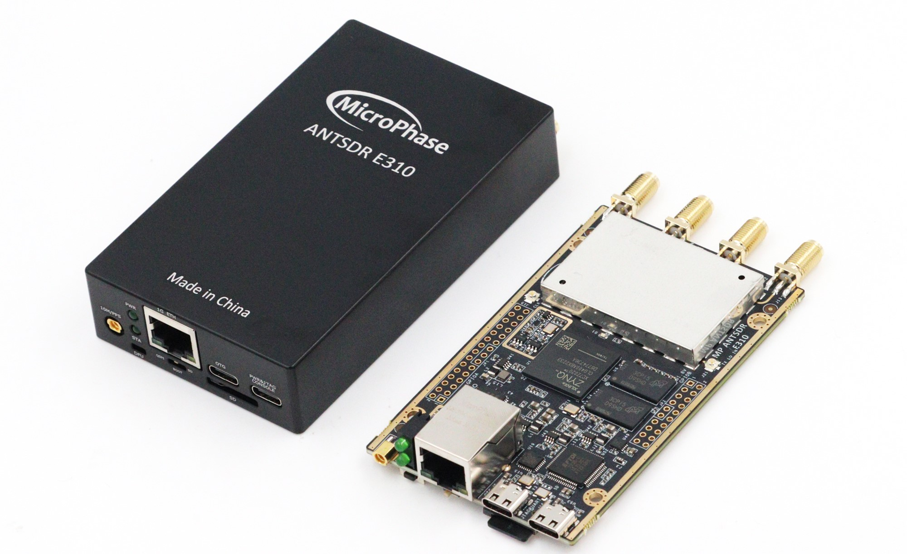

## 入门指南

### ●1. 概述

E310 是一款面向创客和SDR爱好者同时也可以满足专业应用场景的软件无线电,支持70 MHz 到 6 GHz 的宽频段射频信号收发，既可以作为 USB 外设使用，也可以通过编程实现脱机运行。众多的开源项目支持和学习教程，让客户接触更多应用成为可能。

  #### ○资源特性：

- Xilinx Zynq 7020（集成双核 ARM Cortex A9 和 Artix-7 FPGA）

- Analog Devices AD9361/9363 

- 1 个千兆以太网接口

- 1个TYPE-C USB2.0接口

- 1个TYPE-C USB-JTAG&UART接口

- 1个30-Pin 2.54mm间距GPIO拓展口

- 1个20-Pin 2.54mm间距GPIO拓展口

- 1个外部 PPS/10MHz 参考输入接口

- 2 个发射通道和 2 个接收通道，支持半双工或全双工

- 灵活采样率的 12 位 ADC 和 DAC

- 集成射频前端（AD9361：70 MHz - 6 GHz，AD9363：325 MHz - 3.8 GHz）

- 可变模拟带宽（AD9361：200 kHz - 56 MHz，AD9363：200 kHz - 20 MHz）

#### ○软件特性：

- ARM 核心可运行完整的 Linux 系统
- 主机与 E310 之间可通过 libiio接口进行通信

### ●2. 开箱检测

#### ○2.1 物品清单

#### ○2.2 ANTSDR 驱动软件安装

#### ○2.3 连接到电脑

#### ○2.4 ANTSDR 网口测试

#### ○2.5 网络数据传输

### ●3. 
#### ○3.1 

#### ○3.2 

#### ○3.3 
