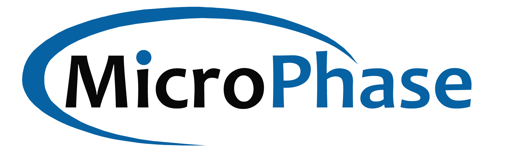

## Company Introduction

Microphase Technology (Shanghai) Co., Ltd. (hereinafter referred to as Microphase Technology, English: MicroPhase) is located in Shanghai, the Pearl of the Oriental World. It focuses on the development and solution provision of embedded software and hardware systems. Our products are module products and system-level boards with FPGA and ARM processors as the core. We pay attention to the application of customers, take the application as the orientation, and listen to the strict application requirements of customers, to provide customers with high reliability and stability of embedded systems and customized solutions. We believe that our customers' success is our success.

Microphase technology products are widely used in various fields. Our application fields include: motion controller and industrial network, network communication and data acceleration, video and image processing, embedded machine vision, semiconductor, scientific research and other microphase technology adhere to customer application demand-oriented, to provide customers with embedded system solutions. In addition to standard products and customized products, Microphase Technology can also produce one-stop solutions according to customer needs.

## Contact Us

- 📞Phone: 021-50902227

-  📧Mailbox: <sales@microphase.cn>

-  💻Website:<http://www.microphase.cn>

-  🏢Address: 3rd floor, Building 2, No. 230 Chuanhong Road, Pudong New Area, Shanghai
