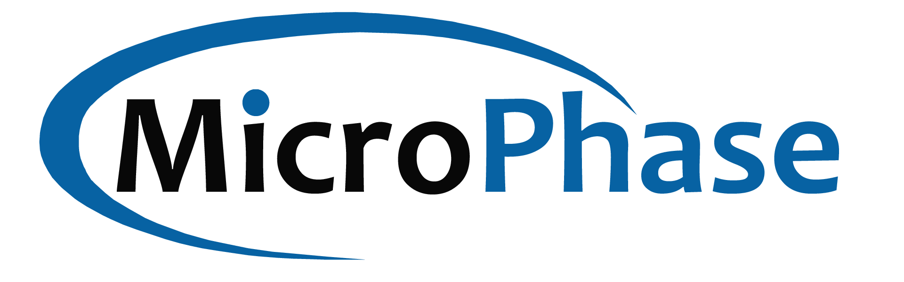

# About MicroPhase

MicroPhase develops FPGA development Platforms, SoMs and Software Define Radio Platforms for engineering teams, scientists and system integrators for algorithm development, prototyping and developing wireless technologies across a wide variety of applications.