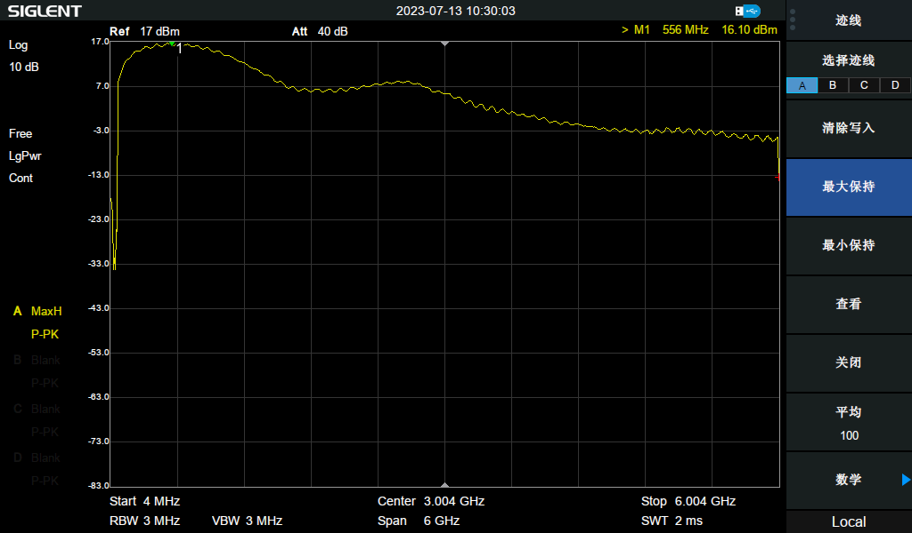
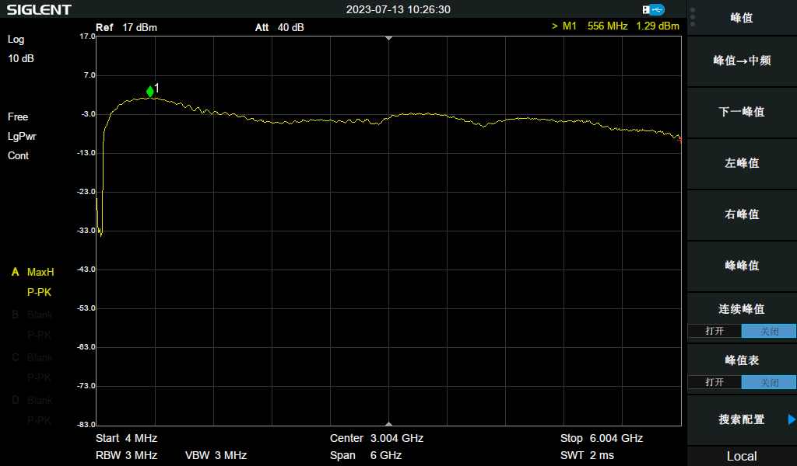

## E200 RF Parameters
[[中文]](../../../cn/device_and_usage_manual/ANTSDR_E_Series_Module/ANTSDR_E200_Reference_Manual/AntsdrE200_RF_parameters_cn.html)

### E200 Tx Power
TX1 RF power

TX2 RF power

The AD9361 is a high-performance, highly integrated RF Agile Transceiver™ designed for 3G and 4G base station applications. Its programmability and wide bandwidth make it an ideal choice for a variety of transceiver applications. The device combines an RF front end with a flexible mixed-signal baseband section and integrates frequency synthesizers, offering a configurable digital interface to the processor, thereby simplifying system integration. The AD9361 receiver LO operates over a frequency range of 70 MHz to 6.0 GHz, and the transmitter LO operates from 47 MHz to 6.0 GHz, covering most licensed and unlicensed bands. It supports channel bandwidths ranging from below 200 kHz up to 56 MHz.

### AD9361 Data Sheet

You can find the ad9361 [Data Sheet](https://www.analog.com/en/products/ad9361.html) here

### ANTSDR Selection

| Signal Name                      | E200                        | E310                     | E316                            |
| -------------                    | ----------                  | --------------           | ----------                      | 
| RFIC                             | AD9361/3                    |   AD9361/3               |AD9361/3                         | 
| RF channel                       | SMA:1T1R IPEX:1T1R          |2T2R MIM+O                 |2T2R MIMO                        |
| Instantaneous bandwidth          |56M (9361), 20M (9363)       |56M (9361), 20M (9363)    |56M (9361), 20M (9363)           |
| FPGA/SoC                         | ZYNQ XC7Z020                | ZYNQ XC7Z020             |ZYNQ XC7Z020                     |
| DDR3                             |PS 512MB                     | PS 1GB                   | PS 1GB                          |  
| Host Interface                   | 1G ETH                      | 1G ETH                   |1G ETH                           |        
| Transmission bandwidth to host   | 20MSPS                      | 10MSPS                   | 20MSPS                          |        
|Clock synchronization             | 10M/PPS                     | 10M/PPS                  | 10M/PPS                         |   
| API                              | Libiio & UHD /C/C++ /PYTHON | Libiio &  C/C++ /PYTHON  |   Libiio & UHD & C/C++ /PYTHON  |     

