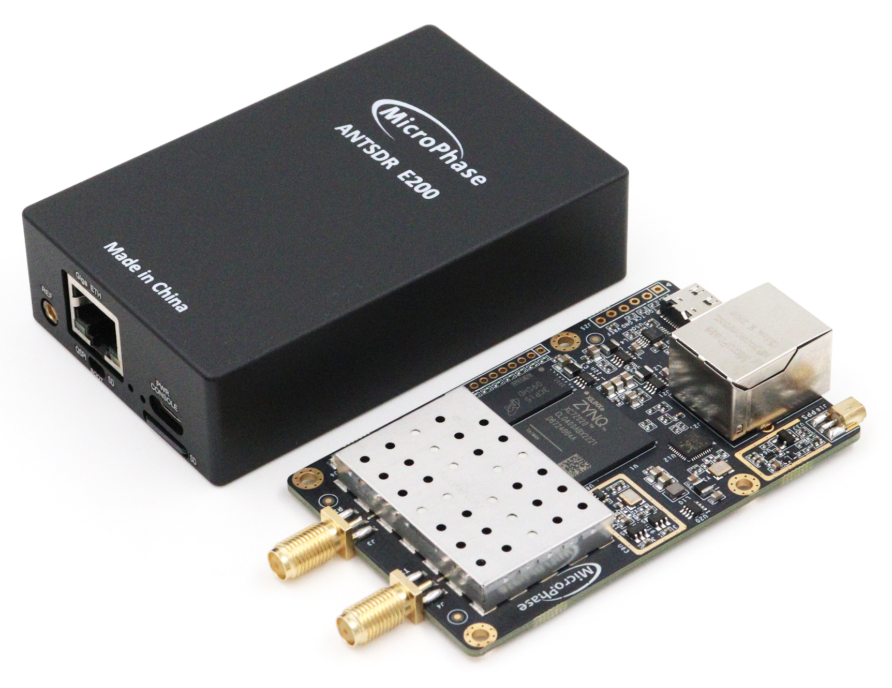

## E200 Hardware Manual

[[中文]](../../../cn/device_and_usage_manual/ANTSDR_E_Series_Module/ANTSDR_E200_Reference_Manual/AntsdrE200_Reference_Manual_cn.html)

### Overview

E200 is a software radio designed for makers and SDR enthusiasts, and can also meet professional application scenarios. It supports wide-band RF signal transmission and reception from 70 MHz to 6 GHz. It can be controlled through Gigabit network and can also be programmed to run offline. Numerous open source project support and learning tutorials make it possible for customers to access more applications.

### Resource Features

- Xilinx Zynq 7020（integrated dual-core ARM Cortex-A9 and Artix-7 FPGA）

- Analog Devices AD9361/9363 

- 1 Gigabit Ethernet interface

- TYPE-C USB-UART interface

- 8-Pin 2.54mm pitch GPIO expansion port

- 1 external PPS/10MHz reference entrance

- 2 transmit channels and 2 receive channels, supporting half-duplex or full-duplex operation.

- Flexible sampling rate 12-bit ADC and DAC

- Integrated RF front-end (AD9361: 70 MHz – 6 GHz, AD9363: 325 MHz – 3.8 GHz)

- Tunable analog bandwidth (AD9361: 200 kHz – 56 MHz, AD9363: 200 kHz – 20 MHz)
