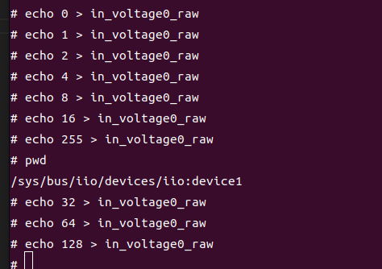

## Set GPIO

[[中文]](../../../cn/device_and_usage_manual/ANTSDR_E_Series_Module/ANTSDR_E200_Reference_Manual/set_gpio_cn.html)

The E200 has eight user-accessible GPIOs.

### Pluto Firmware
E200 has eight user-operable gpio. As for how to use these eight gpio, you can use the following method. Use gpio in pluto firmware, just like directly operating emio to operate it. This method is simple and direct.All released firmware supports.
```
#!/bin/bash

START=995
END=1002

for i in $(seq $START $END); do
  echo $i > /sys/class/gpio/export 2>/dev/null
  echo out > /sys/class/gpio/gpio$i/direction
done

echo "Flip 995~1002..."

while true; do
  for i in $(seq $START $END); do
    echo 1 > /sys/class/gpio/gpio$i/value
  done
  sleep 0.5
  for i in $(seq $START $END); do
    echo 0 > /sys/class/gpio/gpio$i/value
  done
  sleep 0.5
done
```
There is another way to operate gpio, which is only supported in release firmware [v0.34](https://github.com/MicroPhase/antsdr-fw-patch/releases/tag/v0.34)
Log in to the board system using the serial port：
```
Welcome to ANTSDR
ant login: root
Password: 
Welcome to:
    ___    _   _____________ ____  ____ 
   /   |  / | / /_  __/ ___// __ \/ __ \
  / /| | /  |/ / / /  \__ \/ / / / /_/ /
 / ___ |/ /|  / / /  ___/ / /_/ / _, _/ 
/_/  |_/_/ |_/ /_/  /____/_____/_/ |_|  
                                       
v0.34-dirty
https://github.com/MicroPhase/antsdr-fw
# 
# iio_attr -d
IIO context has 6 devices:
	iio:device0, ad9361-phy: found 18 device attributes
	iio:device1, mp-gpio: found 0 device attributes
	iio:device2, xadc: found 1 device attributes
	iio:device3, ref-pll: found 0 device attributes
	iio:device4, cf-ad9361-dds-core-lpc: found 0 device attributes
	iio:device5, cf-ad9361-lpc: found 0 device attributes
```
See the following equipment
```
	iio:device1, mp-gpio: found 0 device attributes
```
Enter the directory
```
# cd /sys/bus/iio/devices/iio\:device1/
# ls
dev              in_voltage1_raw  of_node          subsystem
in_voltage0_raw  name             power            uevent

```
in_volting0_raw can control gpio status

in_volting1_raw can control gpio direction

use the following method to quickly set gpio




Among the 8 gpio, each gpio corresponds to its binary number