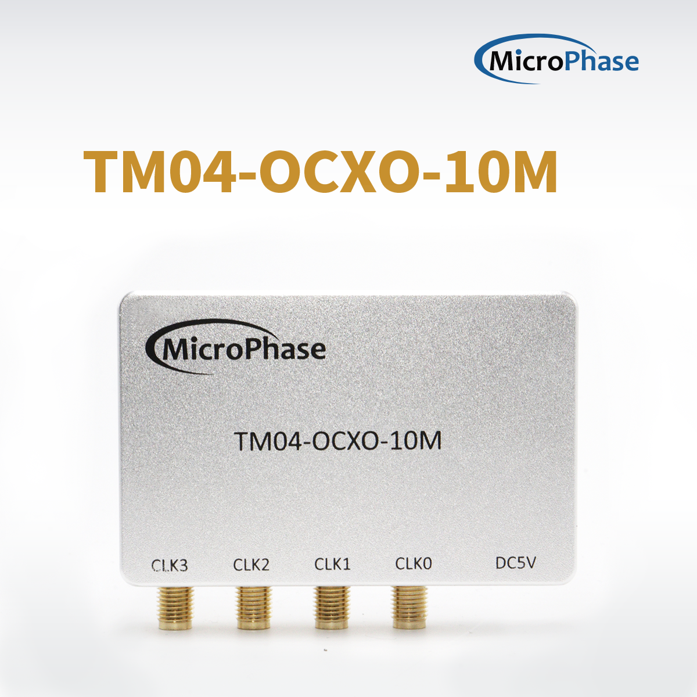
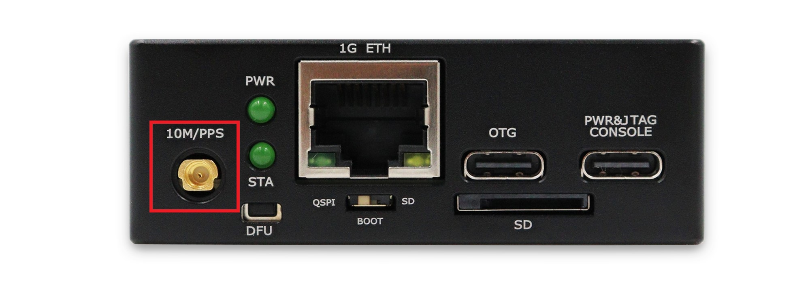

## ANTSDR Clock Calibration

[[中文]](../../../cn/device_and_usage_manual/ANTSDR_E_Series_Module/ANTSDR_E310_Reference_Manual/Antsdr-Clock-calibration_cn.html)

To calibrate the clock, users need to access the system to operate the IIO device file or use the libiio interface on a host computer to access the IIO device named `ad5660mp`. This guide demonstrates calibration via system access.

### Preparation

You need to prepare:


A 10M Clock  


A SMA To MMCX Cable


Connect the SMA-to-MMCX cable to the **10/PPS** port on the AntSDR.

### Accessing `ad5660mp`

First, log into the system through the serial port, with the device user name root and password analog.

```
ant login: root
Password: 
Welcome to:
    ___    _   _____________ ____  ____ 
   /   |  / | / /_  __/ ___// __ \/ __ \
  / /| | /  |/ / / /  \__ \/ / / / /_/ /
 / ___ |/ /|  / / /  ___/ / /_/ / _, _/ 
/_/  |_/_/ |_/ /_/  /____/_____/_/ |_|  
                                       
v0.39-1-g7bcc-dirty
https://github.com/MicroPhase/antsdr-fw-patch

```
You can view the iio device by using the following command: 
```
iio_attr -d
```
You can see that there is an iio device named ad5660mp, and then enter this directory.
```

# iio_attr -d
IIO context has 6 devices:
	hwmon0, e000b000ethernetffffffff00: found 0 device attributes
	iio:device0, ad5660mp: found 1 device attributes
	iio:device1, ad9361-phy: found 19 device attributes
	iio:device2, xadc: found 2 device attributes
	iio:device3, cf-ad9361-dds-core-lpc: found 3 device attributes
	iio:device4, cf-ad9361-lpc: found 3 device attributes

```
```
# cd /sys/bus/iio/devices/iio:device0
# ls
in_voltage_dac_locked      name
in_voltage_dac_mode        of_node
in_voltage_dac_read_value  power
in_voltage_dac_ref_sel     subsystem
in_voltage_dac_value       uevent
in_voltage_raw             waiting_for_supplier
```
You can see the following properties. Next, we will introduce the functions of the following properties.
```
in_voltage_dac_mode         0: Automatic setting. 1: Manual setting. Default is 1
in_voltage_dac_value        Write the value of dac
in_voltage_dac_read_value   Mode 1 User set DAC value Mode 0 External reference calibrated DAC value (23000)
in_voltage_dac_ref_sel      0:10M 1:PPS 2:GPS 
in_voltage_dac_locked       PLL lock status
```
The default state is manual setting, you can view the command through cat. The default is manual mode and the dac value is 23000.

```
# cat in_voltage_dac_mode
1
# cat in_voltage_dac_read_value
23000

```
### Automatic Calibration
10M automatic lock configuration, enter the following command to configure dac to automatic state 10M lock, this way When writing, execute one by one, press Ctrl+C after entering the return to exit, and you can use the cat command to check whether the setting is successful.

```
echo 0 > in_voltage_dac_mode
echo 0 > in_voltage_dac_ref_sel

```
PPS automatic lock configuration
```
echo 0 > in_voltage_dac_mode
echo 1 > in_voltage_dac_ref_sel
```
GPS auto lock configuration
```
echo 0 > in_voltage_dac_mode
echo 2 > in_voltage_dac_ref_sel
```
Wait for tens of seconds.After locking, you can view it through cat in_voltage_dac_locked.
```
# cat in_voltage_dac_locked 
1
```
### Manual Calibration

Manually set the mode and write the value.
```
echo 1 > in_voltage_dac_mode
echo 23000 > in_voltage_dac_value
```