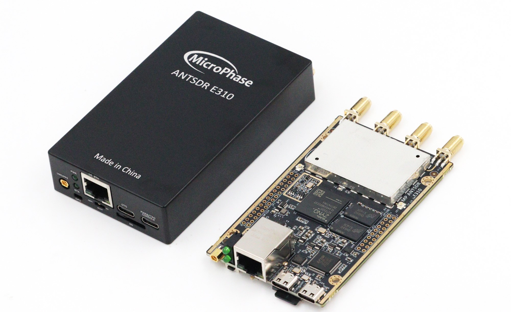

## E310 Hardware Manual

[[中文]](../../../cn/device_and_usage_manual/ANTSDR_E_Series_Module/ANTSDR_E310_Reference_Manual/AntsdrE310_Reference_Manual_cn.html)
### Overview

The E310 is a software-defined radio (SDR) designed for makers and SDR enthusiasts while also meeting professional application requirements. It supports wideband RF signal transmission and reception across 70 MHz to 6 GHz, functioning either as a USB peripheral or operating offline through programming. Backed by extensive open-source projects and learning resources, it empowers users to explore diverse applications.

### Hardware Resources

- Xilinx Zynq-7020 (integrated dual-core ARM Cortex-A9 and Artix-7 FPGA)

- Analog Devices AD9361/9363 

- 1 Gigabit Ethernet interface

- TYPE-C USB 2.0 connector 

- TYPE-C USB-JTAG&UART connection

- 30-Pin 2.54mm GPIO expansion port

- 20-Pin 2.54mm GPIO expansion port

- 1 external PPS/10MHz reference entrance

- 2 transmit channels and 2 receive channels, supporting half-duplex or full-duplex operation.

- Flexible sampling rate 12-bit ADC and DAC

- Integrated RF front-end (AD9361: 70 MHz – 6 GHz, AD9363: 325 MHz – 3.8 GHz)

- Tunable analog bandwidth (AD9361: 200 kHz – 56 MHz, AD9363: 200 kHz – 20 MHz)
