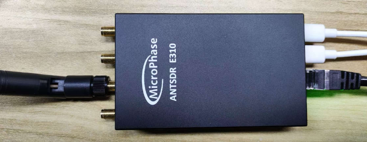

## E310 Unboxing and Inspection


[[中文]](../../../cn/device_and_usage_manual/ANTSDR_E_Series_Module/ANTSDR_E310_Reference_Manual/AntsdrE310_Unpacking_examination_cn.html)


### 1. Overview

The E310 is a software-defined radio (SDR) designed for makers and SDR enthusiasts while also meeting professional application requirements. It supports wideband RF signal transmission and reception across 70 MHz to 6 GHz, functioning either as a USB peripheral or operating offline through programming. Backed by extensive open-source projects and learning resources, it empowers users to explore diverse applications.


### 2. Package Contents

Thank you for purchasing the ANTSDR series SDR platform from MicroPhase Technology. Upon receiving your ANTSDR E310 (Standard Edition), open the accessory kit, which should include the following items:

- ANTSDR SDR Device: X1

- USB data cable: X2 

- rubber stick antenna: X2

- Tray antenna: X1

- Card reader: X1

- Network cable: X1

- 32GB SD card: X1

### 3. Listening to Broadcast Using **Pluto Firmware**

The DIP switch for selecting the boot mode is located below the Ethernet port, labeled “BOOT / QSPI / SD.”
 ANTSDR E310 comes pre-flashed with Pluto firmware on both the SD card and QSPI. Therefore, regardless of whether the system boots from QSPI or SD, the Pluto firmware will be loaded—no additional setup is required.

Once the device has successfully booted, the green LED will start flashing.

If the Pluto firmware is not installed on your device, you can [download it from GitHub](https://github.com/MicroPhase/antsdr-fw-patch/releases) and flash it manually.

Default configuration of the Pluto firmware:

- **IP Address**: 192.168.1.10
- **Username / Password**: root / analog
- **Baud Rate**: 115200

#### ● Windows 

[Download PlutoSDR Drivers](https://wiki.analog.com/university/tools/pluto/drivers/windows)

[Download Serial Drivers](https://ftdichip.com/wp-content/uploads/2021/08/CDM212364_Setup.zip)

○1. Install Windows drivers： **CDM212364_Setup.exe** and **PlutoSDR-M2K-USB-Drivers.exe**.


Then, connect one end of the network cable to the ANTSDR device and the other end to your computer. Connect the antenna to the RX1 port.


○2.After that, you should be able to see the PlutoSDR device in **Computer Management → Device Manager**.

If not, please check whether your firmware is correct, whether your driver is installed, and whether your USB OTG line sequence is correct.


○3. Configure the local IP address, subnet mask, and default gateway. Ensure the local IP address is within the same subnet as the ANTSDR, for example: `192.168.1.100`. Set the subnet mask to `255.255.255.0` and the default gateway to `192.168.1.1`.

○4. The default IP address of the ANTSDR device is `192.168.1.10`.
 Open a **CMD** window and execute the following command to check connectivity:

```
ping 192.168.1.10
```


○5. Receiving Broadcast Signals

Run the **SDRSharp.exe** file in Windows to start listening to the radio.


The ANTSDR device IP is `192.168.1.10`


Once connected, select a radio frequency channel to begin listening.


#### ● Linux

○1. The default IP address of the Pluto firmware is `192.168.1.10`. Set your local IP address to `192.168.1.100`, and then ping `192.168.1.10` to check the connection.


○2. For **libiio** installation, see the [official guide](https://wiki.analog.com/resources/eval/user-guides/ad-fmcdaq2-ebz/software/linux/applications/libiio) or refer to the [E310 GNU Radio](./AntsdrE310_gnurdio.md).


○3. If **libiio** has already been installed, run the following command to verify device detection:

```
iio_info -s
```


The device can be connected via USB OTG.
 Once connected, launch the **SDR++** software.
 After a successful connection, you can begin listening to radio signals.
Once connected, launch the **SDR++** software.
After a successful connection, you can begin listening to radio signals.


