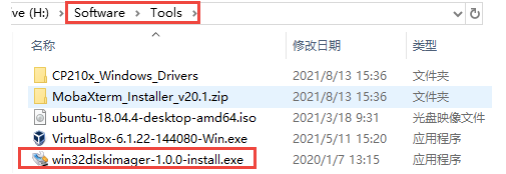
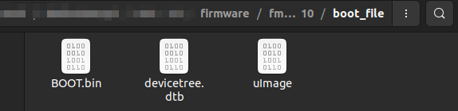
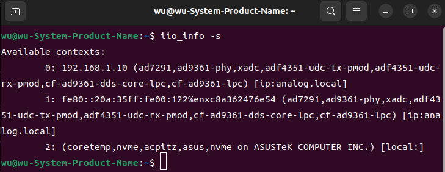

## E310 FMCOMMS

[[中文]](../../../cn/device_and_usage_manual/ANTSDR_E_Series_Module/ANTSDR_E310_Reference_Manual/AntsdrE310_fmcomms_cn.html)

You can find the project on GitHub: [ANTSDR FMCOMMS](https://github.com/MicroPhase/antsdr_fmcomms).

> [!NOTE]
>
> Different versions may have varying features and compatibilities.

###  1. Overview

The ANTSDR FMCOMMS2/3/4 image supports 2T2R operation at a 61.44Msps sampling rate.

### 2. Download Image 

First, download the FMCOMMS firmware.

[Download image-ADI-Kuiper-full.zip](https://wiki.analog.com/resources/tools-software/linux-software/adi-kuiper_images/release_notes)

[ADI AD-FMCOMMS3-EBZ User Guide](https://wiki.analog.com/resources/eval/user-guides/ad-fmcomms3-ebz#:~:text=The%20AD-FMComms3-EBZ%20is%20an%20FMC%20board%20for%20the,be%20found%20on%20the%20the%20ADI%20web%20site)

### 3. FMCOMMS Firmware 

#### 3.1 Writing Images

##### ●Windows

It is recommended that users burn the SD card image under Linux. Due to the difference between Windows and Linux file systems, writing the image under Windows may fail.
After decompressing the image, you can use the image writing tool to flash it to the SD card.

First, you need to prepare a 32GB SD card and format it to FAT32. The capacity of the SD card selected by the user should be larger than the size of the firmware.

[Download Win32DiskImager](https://sourceforge.net/projects/win32diskimager)

The provided package includes a tool called **Win32DiskImager** for writing images. Users can install it and use it to flash the firmware onto the SD card. Simply open the writing tool, select the `.img` firmware file, choose the corresponding SD card device, and click `Write` to begin flashing.


Once the image is successfully flashed, copy the startup file located in the `boot_file` directory (provided via MicroPhase’s shared cloud storage) to the `BOOT` partition of the SD card.

##### ●Linux
```
sudo dd if=2021-02-23-ADI-Kuiper.img of=/dev/sdb bs=1M
```
In this example, `2021-02-23-ADI-Kuiper.img` is the name of the image file after extraction, and `/dev/sdb` represents the mounted SD card device on Ubuntu. Adjust these according to your system setup.

Once the image is successfully flashed, copy the startup file located in the `boot_file` directory (provided via MicroPhase’s shared cloud storage) to the `BOOT` partition of the SD card.



#### 3.2 How To Set The IP Address
After successfully writing the firmware, start ANTSDR and connect to the serial port. To successfully connect to the ANTSDR device running the **FMCOMMS** firmware, you need to configure its network IP address.
```
sudo screen /dev/ttyUSB1 115200
```
`/dev/ttyUSB1` is the uart serial port. If your serial port does not have any message, please check whether the board is started, check whether the serial port is correct, or whether the startup file is copied to the BOOT partition of the board.

In the following steps, we configure ANTSDR's Ethernet interface to use a static IP address, so that it will get the same IP address every time it is powered on, making it easier to access the device in **GNU Radio** or **libiio** on the host computer. 

First open the `/etc/network/interfaces` file.

```
vi /etc/network/interfaces
```
Then, add the following configuration to assign a static IP of `192.168.1.10`
```
auto eth0
iface eth0 inet static
address 192.168.1.10
netmask 255.255.255.0
gateway 192.168.1.1
```
After saving the file, restart ANTSDR using the `reboot` command.

Therefore, when using **libiio** to access the device, you only need to set the address. Here, the IP address of the network port connected to ANTSDR on the user's Linux host must be in the same network segment as ANTSDR. For example, if your host computer has the IP address `192.168.1.100` then we can use libiio to test the connection.

If **libiio** is not already installed on your system, please install it first.

You can refer to this link to install **[libiio](https://wiki.analog.com/resources/eval/user-guides/ad-fmcdaq2-ebz/software/linux/applications/libiio#:~:text=libiio%20is%20a%20library%20that%20has%20been%20developed,of%20software%20interfacing%20Linux%20Industrial%20I%2FO%20%28IIO%29%20devices.)**

or

You can find detailed steps for installing **libiio** in [ANTSDR E310 Gnuradio](./AntsdrE310_gnurdio.html)


If you successfully installed **libiio**, execute `iio_info -s`



If you want to use the **FMCOMMS** firmware with **GNU Radio** and connect to ANTSDR, have a look at **[ANTSDR FMCOMMS](./AntsdrE310_gnurdio.html)**

