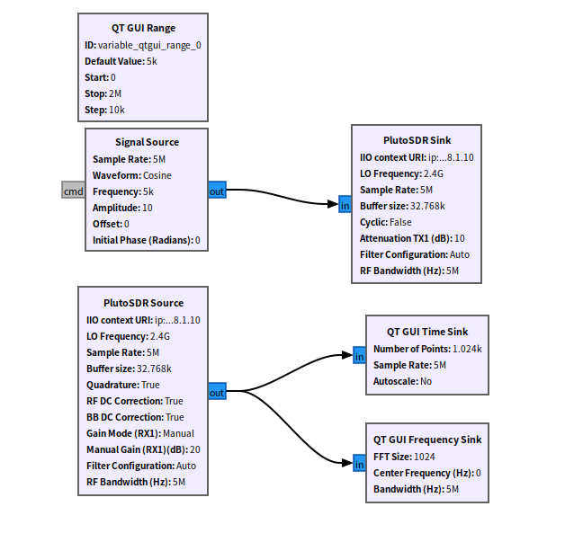
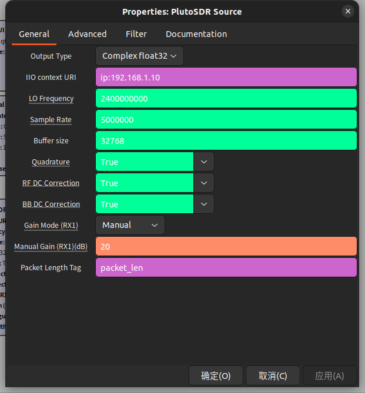
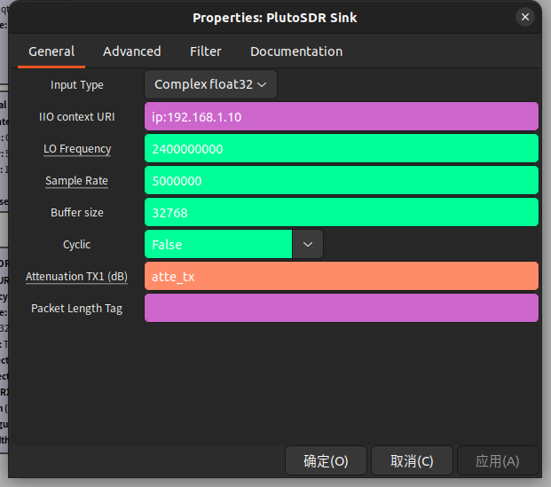
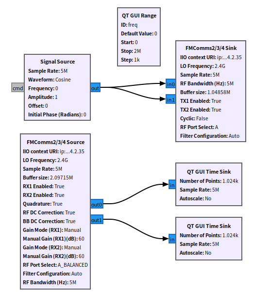
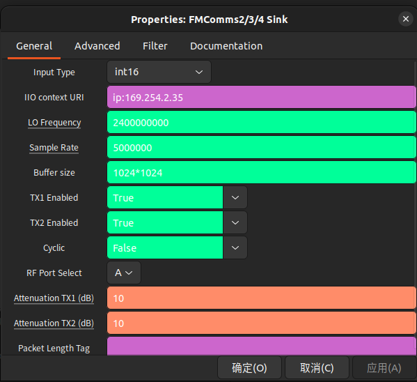
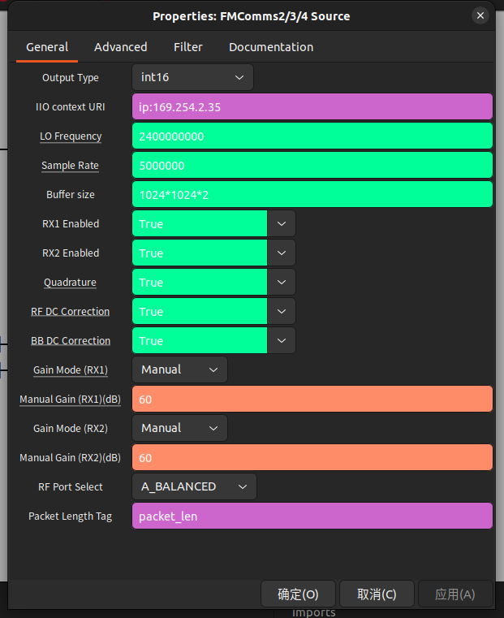

## E310 GNU Radio

[[中文]](../../../cn/device_and_usage_manual/ANTSDR_E_Series_Module/ANTSDR_E310_Reference_Manual/AntsdrE310_gnurdio_cn.html)


### 1. Overview
**[GNU Radio](https://www.gnuradio.org/)** is a free and open-source software development toolkit that provides signal processing blocks for implementing software-defined radios and signal processing systems. It can be used with external RF hardware to create software-defined radio systems or without hardware in a simulation-like environment. GNU Radio is widely used in amateur, academic, and commercial settings to support wireless communications research and the development of real-world radio systems.

GNU Radio offers a comprehensive framework for developing and running software radios and signal processing applications. These applications, often called "flowgraphs", are composed of interconnected signal processing blocks, which are a series of signal processing blocks connected together, describing the flow of data. These flowgraphs can be written in C++ or Python programming languages. The GNU Radio infrastructure is written entirely in C++, while many user tools are written in Python.

As with all software-defined radio systems, reconfigurability is a key feature. GNU Radio's open interfaces make it easy to integrate users' own radio equipment into the GNU Radio ecosystem without designing for specific hardware.

### 2. Installing Libiio on Ubuntu
Different Ubuntu versions are different. You can refer to the [installation materials](https://wiki.analog.com/resources/tools-software/linux-software/gnuradio) for details.
#### ● Installing System Packages
Before installing the Pluto SDR driver, make sure to install the required dependencies using the following commands:
```
sudo apt install libxml2 libxml2-dev bison flex cmake git libaio-dev libboost-all-dev
sudo apt install libusb-1.0-0-dev
sudo apt install libavahi-common-dev libavahi-client-dev
sudo apt install bison flex cmake git libgmp-dev
sudo apt install swig
sudo apt install liborc-dev
```
#### ●Install libiio
You can find the latest version on [github](https://github.com/analogdevicesinc/libiio)

```
git clone -b v0.24 https://github.com/analogdevicesinc/libiio.git
cd libiio
mkdir build
cd build
cmake ../
make
sudo make install
cd ../..
```
#### ● Installing libad9361-iio

```
git clone https://github.com/analogdevicesinc/libad9361-iio.git
cd libad9361-iio
mkdir build
cd build
cmake ../
make
sudo make install
cd ../..

```
### 3. GNU Radio and gr-iio


#### ●Install GNU Radio


```
apt-get update
apt install gnuradio -y
ldconfig
```
After the installation is complete, check the installed version

```
gnuradio-companion -help
```

#### ●Install gr-iio

GNU Radio version 3.8 and above requires `liborc-dev` for gr-iio.

```
(sudo) apt install liborc-dev
```
Build and install gr-iio from source:

```
git clone -b upgrade-3.8 https://github.com/analogdevicesinc/gr-iio.git
cd gr-iio
mkdir build && cd build
cmake -DCMAKE_INSTALL_PREFIX:PATH=/usr ..
make 
sudo make install
cd ..
sudo ldconfig
```

For 3.8, make sure the gr-iio swig interface is on your PYTHONPATH. Otherwise, you will get import errors in python. The common command would be (depending on OS and install location):
```
export PYTHONPATH=$PYTHONPATH:/usr/lib/python{PYTHON VERSION}/{site or dist}-packages
```
The added path is the location of the newly installed iio folder.
For 3.8.2 no additional steps have to be taken


#### ●GNU Radio 3.10

If you are using GNU Radio 3.10 or newer, gr-iio is already provided in the base installation of GNU Radio itself, No need to install gr-iio.

After completing all installations, you can launch GNU Radio by entering the following command in the terminal:
```
gnuradio-companion
```

### 4. Using the Pluto Blocks

Before using the Pluto blocks, ensure that the Pluto firmware is properly installed. You can find the Pluto firmware usage [here](./AntsdrE310_Unpacking_examination.md).

You can find the ANTSDR GNU Radio example [here](https://github.com/MicroPhase/gnu-radio-demo).



#### ●General
**IIO Context URI**: IP:192.168.1.10

**Buffer Size**: The size of the internal buffer in samples. The IIO module can only input or output one buffer of samples at a time.

#### ●PlutoSDR Source

○**RF Bandwidth(MHz)**: Configures RX analog filters: RX TIA LPF and RX BB LPF. [Read more](https://wiki.analog.com/resources/tools-software/linux-drivers/iio-transceiver/ad9361#rx_rf_bandwidth_control)

○**Sample Rate(MSPS)**: Frequency at which the hardware will input/output samples. [Read more](https://wiki.analog.com/resources/tools-software/linux-drivers/iio-transceiver/ad9361#settingquerying_the_rx_sample_rate)

○**LO Frequency(MHz)**: Selects the RX local oscillator frequency. Range 70MHz to 6GHz with 1Hz tuning granularity. [Read more](https://wiki.analog.com/resources/tools-software/linux-drivers/iio-transceiver/ad9361#local_oscillator_control_lo)

○**Tracking**: [Read more](https://wiki.analog.com/resources/tools-software/linux-drivers/iio-transceiver/ad9361#calibration_tracking_controls)

○Quadrature

○RF DC

○BB DC

○**Manual Gain(dB)**: Controls the RX gain only in Manual Gain Control Mode (MGC). [Read more](https://wiki.analog.com/resources/tools-software/linux-drivers/iio-transceiver/ad9361#mgc_setting_the_current_gain)

○**Gain Mode**: Selects one of the available modes: manual, slow_attack, hybrid and fast_attack. [Read more](https://wiki.analog.com/resources/tools-software/linux-drivers/iio-transceiver/ad9361#gain_control_modes)

○**Filter**: Allows a FIR filter configuration to be loaded from a file. [Read more](https://wiki.analog.com/resources/tools-software/linux-drivers/iio-transceiver/ad9361#digital_fir_filter_controls)

○**Filter auto** When enabled loads a default filter and thereby enables lower sampling / baseband rates.



#### ●PlutoSDR Sink

○**RF Bandwidth(MHz)**: Configures TX analog filters: TX BB LPF and TX Secondary LPF. [Read more](https://wiki.analog.com/resources/tools-software/linux-drivers/iio-transceiver/ad9361#tx_rf_bandwidth_control)

○**Sample Rate(MSPS)**: Frequency at which the hardware will input/output samples. [Read more](https://wiki.analog.com/resources/tools-software/linux-drivers/iio-transceiver/ad9361#settingquerying_the_tx_sample_rate)

○**LO Frequency(MHz)**: Selects the TX local oscillator frequency. Range 70MHz to 6GHz with 1Hz tuning granularity. [Read more](https://wiki.analog.com/resources/tools-software/linux-drivers/iio-transceiver/ad9361#local_oscillator_control_lo)


○**RF Port Select**: Selects the RF port to be used. [Read more](https://wiki.analog.com/resources/tools-software/linux-drivers/iio-transceiver/ad9361#rf_port_selection)

○**Attenuation (dB)**: Individually controls attenuation for TX1 and TX2. The range is from 0 to -89.75 dB in 0.25dB steps. [Read more](https://wiki.analog.com/resources/tools-software/linux-drivers/iio-transceiver/ad9361#tx_attenuation_control)

○**Cyclic**: Set to “true” if the “cyclic” mode is desired. In this case, the first buffer of samples will be repeated on the enabled channels of the FMCOMMS-2 until the program is stopped.
The FMCOMMS-2 IIO block will report its processing as complete: the blocks connected to the PlutoSDR IIO block won't execute anymore, but the rest of the flow graph will.

○**Filter**: Allows a FIR filter configuration to be loaded from a file. [Read more](https://wiki.analog.com/resources/tools-software/linux-drivers/iio-transceiver/ad9361#digital_fir_filter_controls)

○**Filter auto** When enabled loads a default filter and thereby enables lower sampling / baseband rates.




### 5. Using the FMCOMMS Blocks

Before use, you need to use the FMCOMMS firmware. You can find the usage of the FMCOMMS firmware [here](./AntsdrE310_fmcomms.md).

The FMCOMMS-2 IIO blocks can run over the IP network or USB. By setting the “IIO context URI” parameter to the IP address of the target board, you can stream samples from/to the remote board



**IIO Context URI**: IP:192.168.1.10

**Buffer Size**: The size of the internal buffer in samples. The IIO module can only input/output one buffer containing samples at a time

#### ●FMCOMMS Source
○**RF Bandwidth(MHz)**: Configures TX analog filters: TX BB LPF and TX Secondary LPF. [Read more](https://wiki.analog.com/resources/tools-software/linux-drivers/iio-transceiver/ad9361#rx_rf_bandwidth_control)

○**Sample Rate(MSPS)**: Frequency at which the hardware will input/output samples . [Read more](https://wiki.analog.com/resources/tools-software/linux-drivers/iio-transceiver/ad9361#settingquerying_the_rx_sample_rate)

○**LO Frequency(MHz)**: Selects the TX local oscillator frequency. Range 70MHz to 6GHz with 1Hz tuning granularity. [Read more](https://wiki.analog.com/resources/tools-software/linux-drivers/iio-transceiver/ad9361#local_oscillator_control_lo)

○**RF Port Select**: Selects the RF port to be used. Can be either any of the inputs on the Rx input mux (in single ended or differential) or the Tx monitor input. [Read more](https://wiki.analog.com/resources/tools-software/linux-drivers/iio-transceiver/ad9361#rf_port_selection)

○**Tracking**: [Read more](https://wiki.analog.com/resources/tools-software/linux-drivers/iio-transceiver/ad9361#calibration_tracking_controls)

○Quadrature

○RF DC

○BB DC

○**Manual Gain(dB)**: Controls the RX gain only in Manual Gain Control Mode (MGC). [Read more](https://wiki.analog.com/resources/tools-software/linux-drivers/iio-transceiver/ad9361#mgc_setting_the_current_gain)

○**Gain Mode(RX1, RX2)**: Selects one of the available modes: manual, slow_attack, hybrid and fast_attack. [Read more](https://wiki.analog.com/resources/tools-software/linux-drivers/iio-transceiver/ad9361#gain_control_modes)




#### ●FMCOMMS Sink

○**RF Bandwidth(MHz)**: Configures TX analog filters: TX BB LPF and TX Secondary LPF. [Read more](https://wiki.analog.com/resources/tools-software/linux-drivers/iio-transceiver/ad9361#rx_rf_bandwidth_control)

○**Sample Rate(MSPS)**: Frequency at which the hardware will input/output samples . [Read more](https://wiki.analog.com/resources/tools-software/linux-drivers/iio-transceiver/ad9361#settingquerying_the_rx_sample_rate)

○**LO Frequency(MHz)**: Selects the TX local oscillator frequency. Range 70MHz to 6GHz with 1Hz tuning granularity. [Read more](https://wiki.analog.com/resources/tools-software/linux-drivers/iio-transceiver/ad9361#local_oscillator_control_lo)

○**RF Port Select**: Selects the RF port to be used. Can be either any of the inputs on the Rx input mux (in single ended or differential) or the Tx monitor input. [Read more](https://wiki.analog.com/resources/tools-software/linux-drivers/iio-transceiver/ad9361#rf_port_selection)

**Attenuation(RX1, RX2)(dB)**: Individually controls attenuation for TX1 and TX2. The range is from 0 to -89.75 dB in 0.25dB steps. [Read more](https://wiki.analog.com/resources/tools-software/linux-drivers/iio-transceiver/ad9361#tx_attenuation_control)


○**Cyclic**: Set to “true” if the “cyclic” mode is desired. In this case, the first buffer of samples will be repeated on the enabled 
channels of the FMCOMMS-2 until the program is stopped.

The FMCOMMS-2 IIO block will report its processing as complete: the blocks connected to the FMCOMMS-2 IIO block won't execute anymore, but the rest of the flow graph will.

○**TX1/TX2** Enabled: Enables the transmit data path

○**Filter**: Allows a FIR filter configuration to be loaded from a file. [Read more](https://wiki.analog.com/resources/tools-software/linux-drivers/iio-transceiver/ad9361#digital_fir_filter_controls)

○**Filter auto** When enabled, a default filter is loaded, enabling lower sampling and baseband rates.


