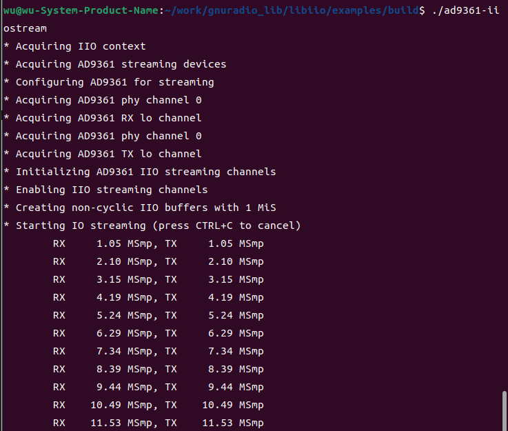

## E310 libiio

[[中文]](../../../cn/device_and_usage_manual/ANTSDR_E_Series_Module/ANTSDR_E310_Reference_Manual/AntsdrE310_libiio_cn.html)

### 1. Overview

**Libiio** is a library developed by Analog Devices to simplify software development for interfacing with Linux Industrial I/O (IIO) devices. It provides a simple and comprehensive programming interface suitable for advanced projects.
In this guide, we compile and run a **libiio** example on both a host and an embedded platform. The example configures the RF front-end using a C/C++ interface and handles IQ data streaming for both transmission and reception.
This document is intended for readers with basic programming knowledge and involves C/C++, cross-compilation, etc. All instructions are based on the Ubuntu Linux platform.

### 2. Install the libiio

If libiio is not already installed, you need to install it first.
You can refer to the following link to install **[libiio](https://wiki.analog.com/resources/eval/user-guides/ad-fmcdaq2-ebz/software/linux/applications/libiio#:~:text=Libiio%20is%20a%20library%20that%20has%20been%20developed,of%20software%20interfacing%20Linux%20Industrial%20I%2FO%20%28IIO%29%20devices.)**

or

You can find detailed steps for installing **libiio** in [ANTSDR E310 GNU Radio](./AntsdrE310_gnurdio.md)


If you successfully installed **libiio**, execute iio_info -s


### 3. Source Code
MicroPhase provides source code for users. Compile the `ad9361-iiostream.c` file and run it.
First, create a folder named `libiio_example` with subfolders `arm` and `host`, and copy `ad9361-iiostream.c` into both.

You need to [download the code](https://github.com/MicroPhase/antsdr_doc_en/tree/master/demo/iio).

After the download is complete, go to the directory where you downloaded it.

To run the program directly on your host computer, execute the following commands:
```
mkdir build && cd build
cmake ..
make
./ad9361-iiostream
```
Execute `./ad9361-iiostream` and you will see the result as shown below


If you intend to run the program on the ARM platform, cross-compilation is required. We need arm compilation tools. The 32-bit compiler tool that comes with the **Xilinx SDK** is used here. The version of the compilation tool and the version of the firmware need to be consistent.
```
set (CMAKE_C_COMPILER "/tools/Xilinx/SDK/2019.1/gnu/aarch32/lin/gcc-arm-linux-gnueabi/bin/arm-linux-gnueabihf-gcc")
set (CMAKE_CXX_COMPILER "/tools/Xilinx/SDK/2019.1/gnu/aarch32/lin/gcc-arm-linux-gnueabi/bin/arm-linux-gnueabihf-g++")
```
You can find the relationship between the compilation toolchain and version in [ANTSDR-FW-Patch](./Antsdr-fw-patch.md)

Use the scp command to send it to ANTSDR and run.
```
scp ad9361-iiostream root@192.168.1.10:~
```
Log in to the board via ssh or serial port
```
./ad9361-iiostream
```
You can find the libiio interface [here](https://analogdevicesinc.github.io/libiio/master/libiio/index.html).