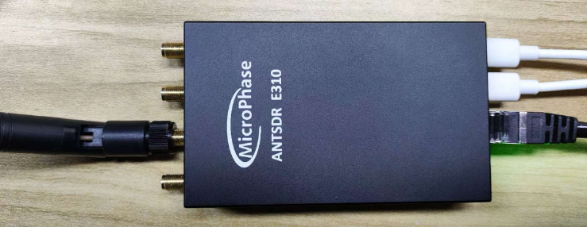
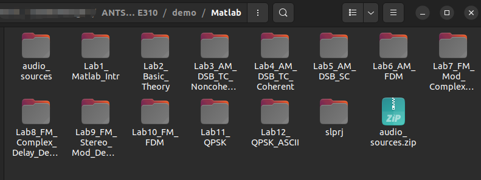
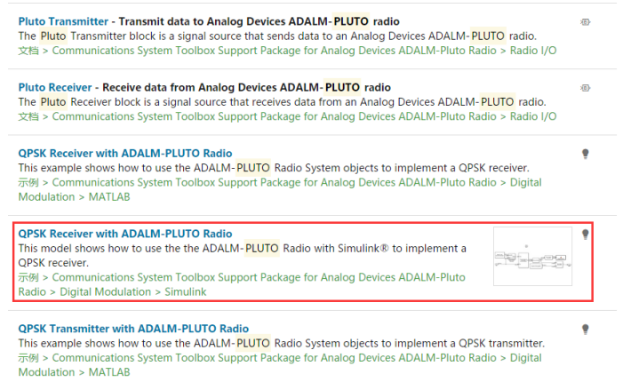
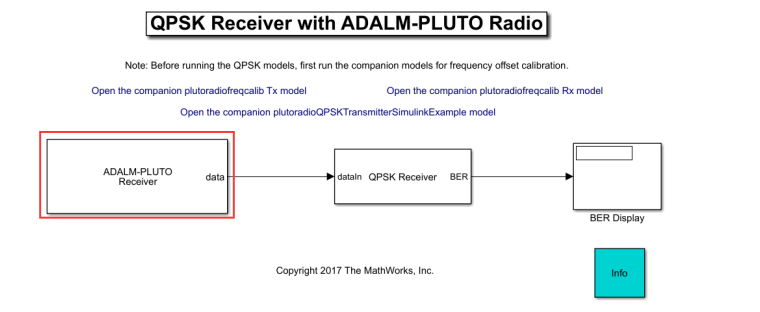
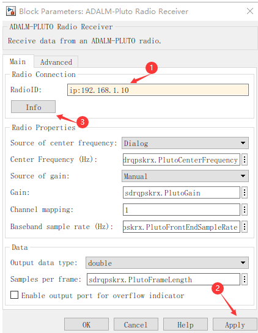
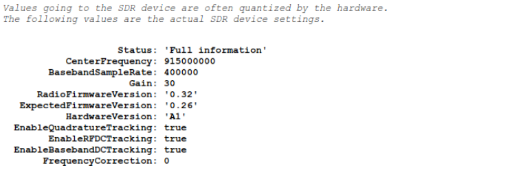

## E310 MATLAB


[[中文]](../../../cn/device_and_usage_manual/ANTSDR_E_Series_Module/ANTSDR_E310_Reference_Manual/AntsdrE310_matlab_cn.html)

### 1. Overview

Using ANTSDR, users can easily access various SDR software and experiment with a wide range of radio applications. For example, with **GNU Radio** and **MATLAB & Simulink**, users can implement algorithms related to communications and signal processing, and then use ANTSDR to transmit and receive signals. Open-source software can also be used to explore features such as broadcast demodulation, TV signal decoding, aircraft tracking, and more.

This chapter describes the installation of the PlutoSDR hardware support package. All MATLAB-related experiments are conducted on the Windows 10 platform. Therefore, the necessary drivers must be installed to ensure correct functionality of the ANTSDR hardware. To download and install **MATLAB & Simulink**, please visit the official **MATLAB** website.

The installation process under **Ubuntu** is the same as on **Windows**.

If this is your first time using ANTSDR, please refer to the [Unpacking Examination](./AntsdrE310_Unpacking_examination.md).

### 2. **Install the Driver**

If you haven't installed the PlutoSDR driver yet, you can download it from the following link:
[Download Windows Driver](https://wiki.analog.com/university/tools/pluto/drivers/windows)

The driver is also included in the provided resources. Double-click the `.exe` file and follow the prompts to complete the installation.

ANTSDR uses a ZYNQ processor with two A9 cores capable of running an operating system. It uses a ported version of the PlutoSDR firmware, which allows users to access ANTSDR hardware via the command line.

The PlutoSDR firmware can be downloaded from [GitHub](https://github.com/MicroPhase/antsdr-fw-patch/releases).

### 3. Installing Hardware Support Packages

In this guide, MATLAB R2018a is used. Users may choose to install version R2018a or later. The Simulink models provided are based on the R2018a version.

After installing MATLAB, the PlutoSDR hardware support package must be installed in order to use ANTSDR. From the MATLAB top menu, select **Add-Ons** > **Get Hardware Support Packages**.

Search for `Pluto` and select **Communications Toolbox Support Package for Analog Devices PlutoSDR Radio**.

During the installation, a MathWorks account is required. Users can register for an account online and log in.

You can find the official installation guide for ADALM-PLUTO on the [MathWorks website](https://ww2.mathworks.cn/help/comm/plutoradio/ug/install-support-package-for-pluto-radio.html).

After installation, close all instances of MATLAB, restart it, and proceed to the next steps.



When the ANTSDR system is started, the Ethernet IP address is 192.168.1.10. In order for the host to access ANTSDR normally, the computer's IP address needs to be set to the same network segment as ANTSDR. You can refer to the network settings in the [Unpacking examination](./AntsdrE310_Unpacking_examination.md).

### 4.Test Connection

#### ●Test Connection Using Simulink Example

After setting the IP address of the host computer, use the PlutoSDR sample programs in MATLAB to test the connection status of ANTSDR.

All MATLAB demos can be found in the provided materials.


Enter `pluto` in the MATLAB search box in the upper-right corner, then open a Simulink model from the results.




Select **Open Model** to launch the Simulink diagram.



Double-click the **ADALM-PLUTO Receiver block** to configure the settings. In the dialog, set the Radio ID to:

```
ip:192.168.1.10
```

Then click **Apply**, and then click **Info** to see the information of the current device.






#### ●Connect to MATLAB Using FMCOMMS Mirror

If you are unfamiliar with using FMCOMMS images on the E310, please refer to the [ANTSDR FMCOMMS](./AntsdrE310_fmcomms.md) chapter first.
In this section, MATLAB R2021a is used and recommended.

Open MATLAB and download the version-compatible toolkit from [this GitHub page](https://github.com/analogdevicesinc/TransceiverToolbox/releases). Then, double-click the downloaded `.mltbx` file in MATLAB to install the toolbox. 

Set the host computer IP to `192.168.1.100`, ensuring it is on the same subnet as the device. Confirm connectivity by pinging the device.
Create a new script in MATLAB and run the following code to test the connection:

```
clear all;

%% Tx set up
tx = adi.AD9361.Tx; 
tx.uri = 'ip:192.168.1.10';  
tx.DataSource = 'DDS';   
tx.DDSFrequencies = [0 0; 1e5 1e5]; 
tx.DDSPhases = [0 0; 180e3 0]; 
tx.DDSScales = [0 0; 1 1]; 
tx.CenterFrequency = 2.4e9; 
tx.RFPortSelect = 'B';
tx();
pause(1);       

%% Rx set up
rx = adi.AD9361.Rx('uri','ip:192.168.1.10');
rx.CenterFrequency = tx.CenterFrequency;
rx.EnabledChannels = [1,2];
rx.GainControlModeChannel0 = 'manual';
rx.GainControlModeChannel1 = 'manual';
rx.GainChannel0 = 50;
rx.GainChannel1 = 50;
rx.SamplingRate = 3e6;
y = rx();   

tx.release();
rx.release(); %释放资源

%将衰减器连接在TX1上，连接一个1分2接到rx上
out=y';
figure(1); 
plot(real(out(1,1:1000)));
hold on;
plot(imag(out(1,1:1000)));
figure(2) 
plot(real(out(2,1:1000)));
hold on;
plot(imag(out(2,1:1002)))
```
