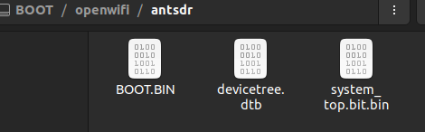
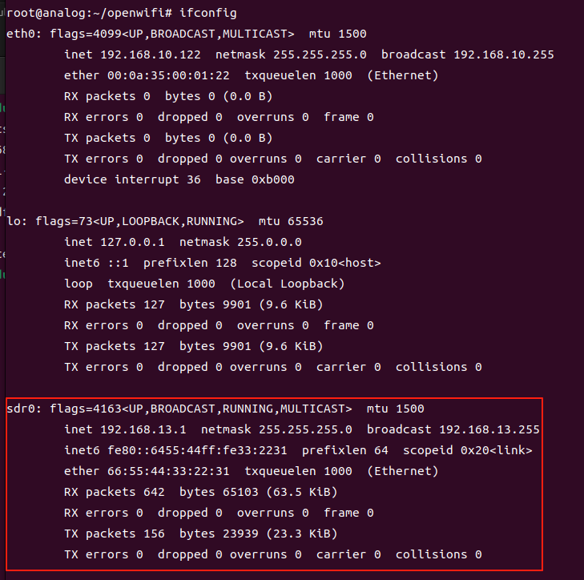
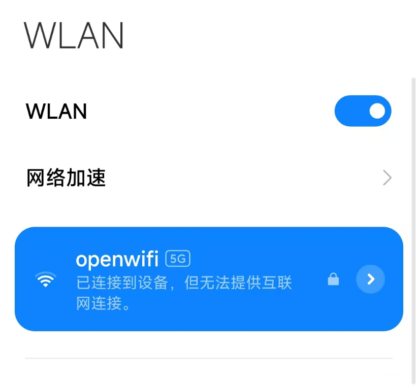

## E310 OpenWiFi


[[中文]](../../../cn/device_and_usage_manual/ANTSDR_E_Series_Module/ANTSDR_E310_Reference_Manual/AntsdrE310_openwifi_cn.html)

### ●1. Overview
OpenWiFi is an open-source project based on the ZYNQ7000 and AD936x platforms. It implements an IP core on the FPGA to process WiFi signals, meeting the low-latency requirements of WiFi transmission. This project also implements the driver of OpenWiFi IP on linux. Based on this open source project, users can understand the underlying working principle of WiFi. Interested users can learn more about it on the github homepage of the project. Its GitHub repository address is as follows:

[https://github.com/open-sdr/openwifi](https://github.com/open-sdr/openwifi)

This manual describes how to use the ANTSDR E310 to run OpenWiFi.

### ●2. Writing images in Ubuntu

Before you begin, [download](https://drive.google.com/file/d/12egFLT9TclmY8m3vCMHmUuSne3qK0SWc/view?pli=1) the OpenWiFi image file.

Unzip the image and write it to an SD card (at least 16GB). After writing, the SD card should contain two partitions: `BOOT` and `rootfs`.

You can use the `dd` command to write the image to the SD card.

```
sudo dd bs=512 count=31116288 if=openwifi-xyz.img of=/dev/your_sdcard_dev
(To have correct count value, better to check the .img file actual situation by "fdisk -l img_filename")
```
After the SD card is writing,
Insert the SD card into the computer and copy the startup file to the BOOT partition of the SD card. The location of the startup file is in the OpenWiFi directory under the BOOT partition. This directory stores the startup files of different devices. The startup file of the ANTSDR E310 device is in the ANTSDR directory



### ●3.Start the System

Insert the SD card into the ANTSDR E310. Set the DIP switch to boot from the SD card. At this time, connect the power supply and the system will start. If you want to observe the print information of the system startup, you can use the terminal tool to connect to the serial port.
```
sudo screen /dev/ttyUSB1 115200
```
Once the system has booted, enter the following commands in the serial terminal to configure the ANTSDR E310 as a WiFi router.

```
./openwifi/setup_once.sh (Reboot the board. Only need to run once for new board)
cd openwifi
./wgd.sh
./fosdem.sh
```
After the commands are executed, you should see a message such as `sdr0: AP-ENABLED`, indicating that the ANTSDR is functioning as a WiFi AP. At this time, you can use the `ifconfig` command to see that there is an additional `sdr0` in the current network device.



At this time, the user takes out his mobile phone, turns on wifi and should be able to search for a device called openwif.



At this stage, the WiFi network does not have Internet access. However, once connected, users can open the built-in OpenWiFi webpage. When connected to OpenWiFi, users can enter 192.168.13.1 in the browser to open the built-in web page of OpenWiFi.

If the user wants to connect to the Internet through OpenWiFi running on ANTSDR, the user needs to have a Linux computer, use an Ethernet cable to connect ANTSDR E310 to the network port of the Linux computer, and then enter the following command in the Linux system terminal
```
sudo sysctl -w net.ipv4.ip_forward=1
sudo iptables -t nat -A POSTROUTING -o NICY -j MASQUERADE
sudo ip route add 192.168.13.0/24 via 192.168.10.122 dev ethX 
```
`NICY` refers to the network interface on the user's computer that provides Internet access (e.g., `wlan0`). `ethX` is the Ethernet interface connected to the ANTSDR.

Example:

```
sudo sysctl -w net.ipv4.ip_forward=1
sudo iptables -t nat -A POSTROUTING -o wlan0 -j MASQUERADE
sudo ip route add 192.168.13.0/24 via 192.168.10.122 dev eth0
```
At this point, you can use your mobile phone to connect to OpenWiFi and then connect to the Internet through OpenWiFi. This enables the ANTSDR E310 to function as a basic WiFi router with Internet access.