## ANTSDR Standalone (no-OS)  

[[中文]](../../../cn/device_and_usage_manual/ANTSDR_E_Series_Module/ANTSDR_E310_Reference_Manual/Antsdr_standalone_cn.html)


### ANTSDR_no-OS
[Latest project address](https://github.com/MicroPhase/antsdr_standalone)
Standalone application based on ADI hdl and no-OS for ANTSDR.

### Restore Vivado Project Under Windows and Linux

#### Required Software

- git (for downloading source code from github)
- vivado2021.1 (for restoring projects)
- vitis 2021.1 (for building no-OS test programs)

#### Download Source Code

First, you need to download the corresponding source code from GitHub. Open **git bash**, and then use the following command in **MinGW** to download the source code.

```
git clone --recursive https://github.com/MicroPhase/antsdr_standalone.git
```

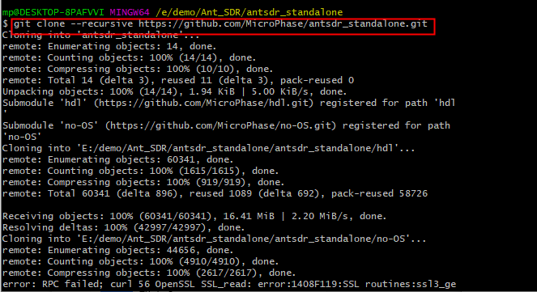

Note: 

​	When downloading source code, use --recursive to recursively download files in submodules. Only in this way can we ensure that the required versions are consistent.

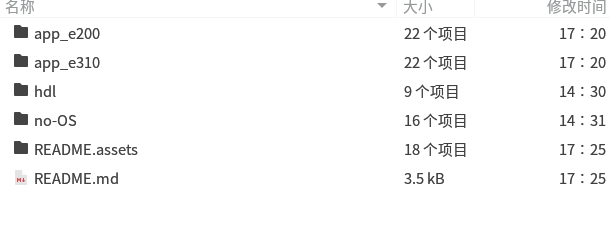

After downloading the source code, you will see a **hdl** folder. Next, we will introduce how to use vivado2021.1 to restore the project under Windows.

#### Restore the Project Using the Vivado TCL Command Line

For information about using vivado to restore a project, please refer to the official instructions of adi：[ADI HDL Building](https://wiki.analog.com/resources/fpga/docs/build)

Open vivado2021.1 and enter the directory where the antsdr project is located in the tcl command window: the specific path depends on your own situation. Typically, this is located in the `hdl/project/antsdre310`, `hdl/project/antsdre200`, or `hdl/project/antsdre316 (e310v2)` directory.

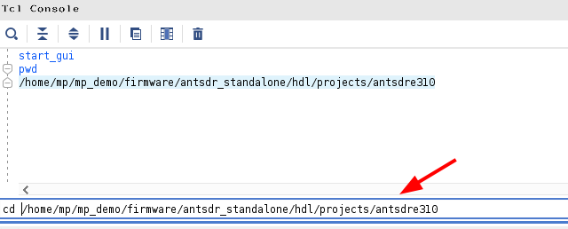

Then execute the following commands in sequence:

```
source ../scripts/adi_make.tcl
adi_make::lib all
source ./system_project.tcl
```

After executing the above command, Vivado will check the required IP in turn, create the required IP, generate the Vivado project and complete the generation of the bit file.

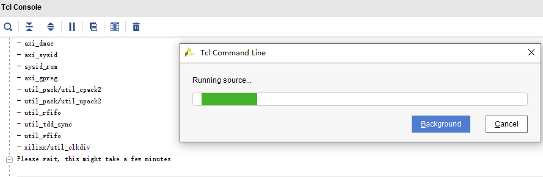

It takes a long time for Vivado to build IP and projects. Please be patient.

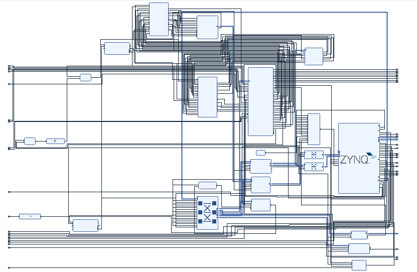


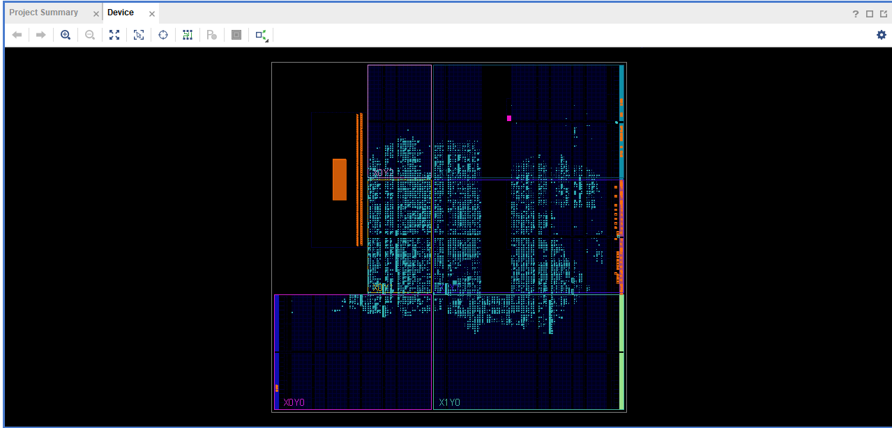

After the entire project is integrated, you can find the hardware description file in the **antsdre310.sdk** or **antsdre200.sdk** **antsdre316.sdk** folder of the project. This hardware description file can be used to build a no-OS project.


#### Build no-OS Project
To simplify the process of building no-OS, use the provided source code located in the `app_e310`, `app_e200`, or `app_e316` folders within the cloned repository

Open the vitis software and locate the **antsdrxxx.sdk** directory

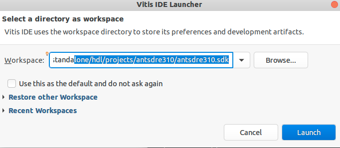

Create a new project

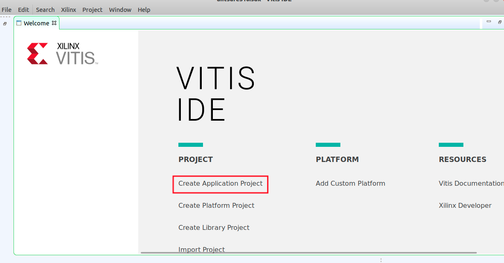

First, you need to create a hardware platform based on the exported .xsa file.

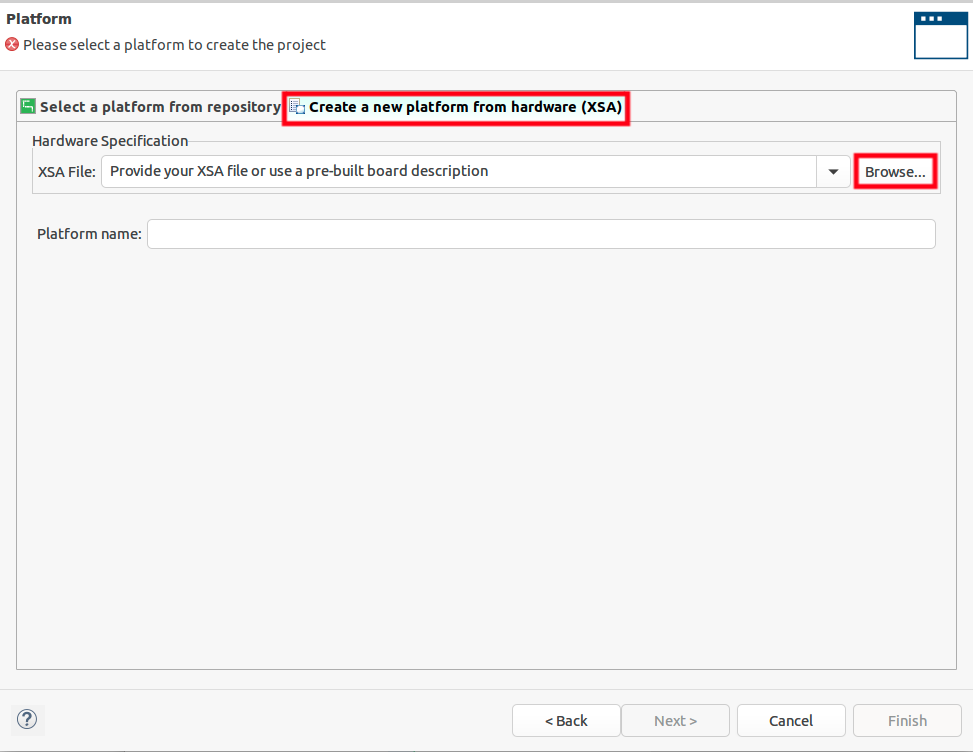

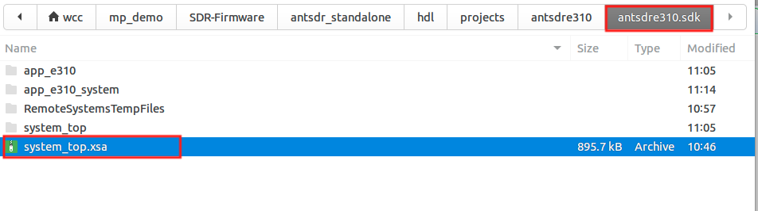

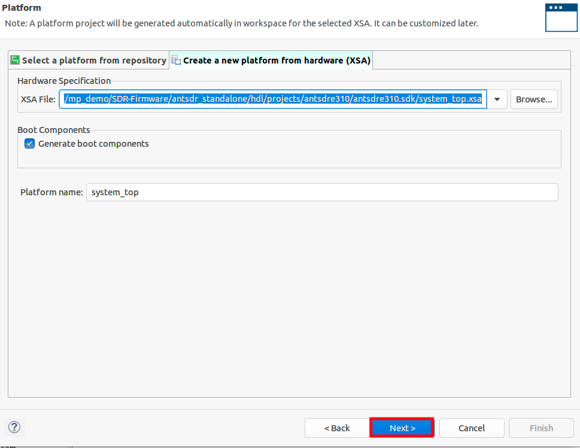

After creating the hardware platform, you can create a new software project.

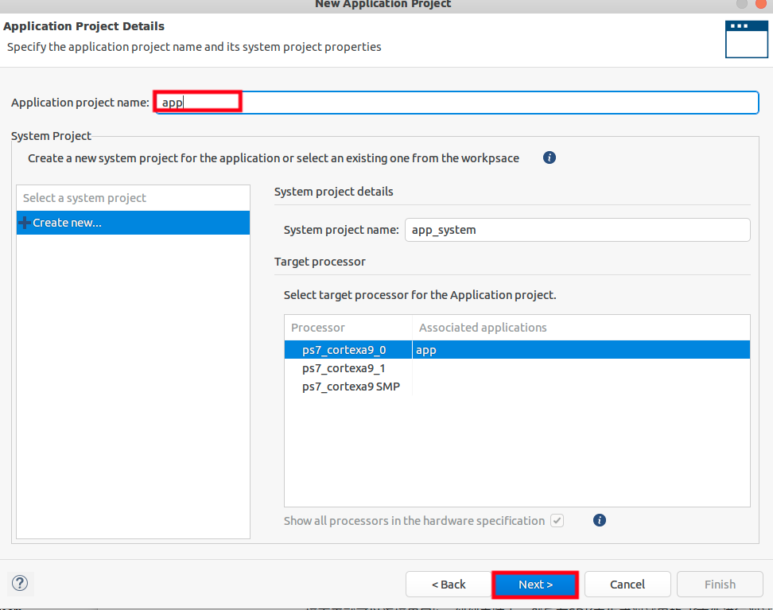

When choosing a template, just select an empty project.

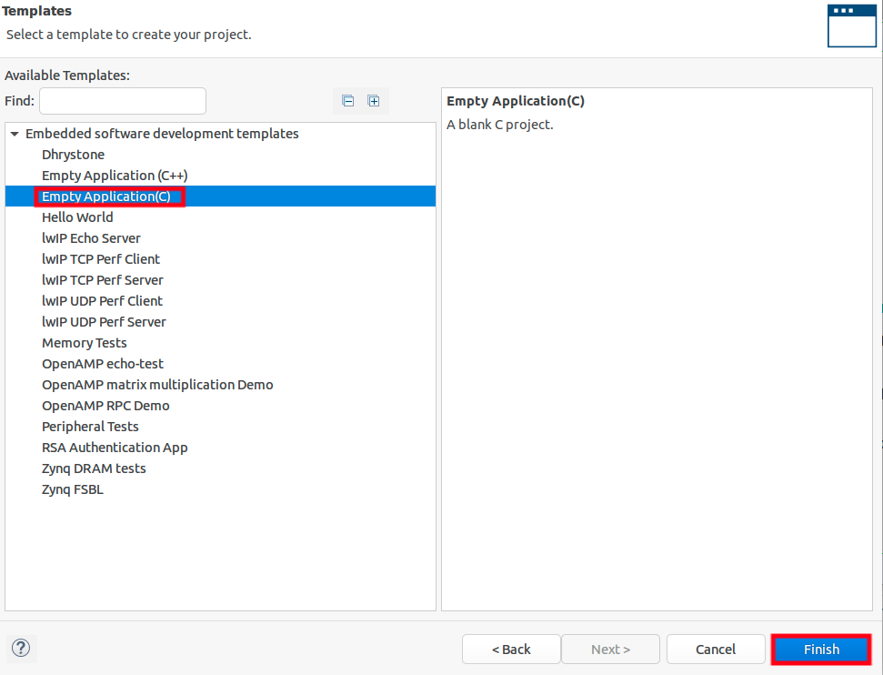

Then copy the contents of `app_e200`, `app_e310`, or `app_e316` from the repository into the current `src` folder, and then click Compile to generate an executable program.

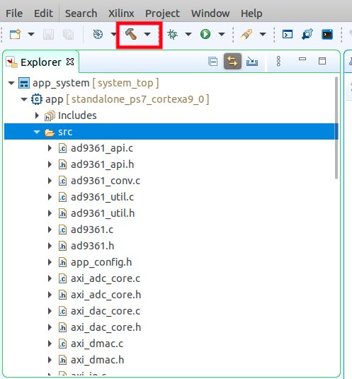

### Functional Testing

Next, you can connect the serial port jtag to the computer, and then generate the elf file for debugging in the SDK for debugging.

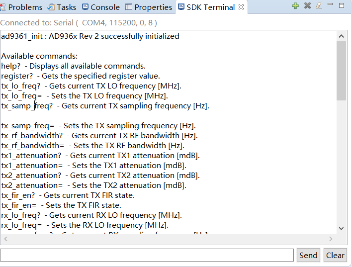


### NOTE

The project is based on ADRV9361, which supports 2R2T and allows modification of the local oscillator, sampling rate, gain, frequency, and baseband signal amplitude via the serial port.
