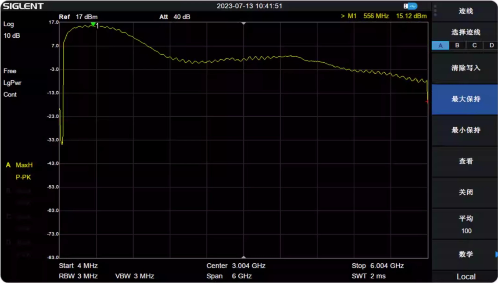

## E316 RF Parameters
[[中文]](../../../cn/device_and_usage_manual/ANTSDR_E_Series_Module/ANTSDR_E316_Reference_Manual/AntsdrE316_RF_parameters_cn.html)

### E316 Tx Power

The AD9361 is a high performance, highly integrated radio frequency (RF) Agile Transceiver™ designed for use in 3G and 4G base station applications. Its programmability and wideband capability make it ideal for a broad range of transceiver applications. The device combines a RF front end with a flexible mixed-signal baseband section and integrated frequency synthesizers, simplifying design-in by providing a configurable digital interface to a processor. The AD9361 receiver LO operates from 70 MHz to 6.0 GHz and the transmitter LO operates from 47 MHz to 6.0 GHz range, covering most licensed and unlicensed bands. Channel bandwidths from less than 200 kHz to 56 MHz are supported.

### AD9361 Data Sheet

You can find the ad9361 Data Sheet here:

[Data Sheet](https://www.analog.com/en/products/ad9361.html)

### ANTSDR Selection

| Signal Name                    | E200                        | E310                    | E316                         |
| ------------------------------ | --------------------------- | ----------------------- | ---------------------------- |
| RFIC                           | AD9361/3                    | AD9361/3                | AD9361/3                     |
| RF channel                     | SMA:1T1R IPEX:1T1R          | 2T2R MIMO               | 2T2R MIMO                    |
| Instantaneous bandwidth        | 56M (9361), 20M (9363)      | 56M (9361), 20M (9363)  | 56M (9361), 20M (9363)       |
| FPGA/SoC                       | ZYNQ XC7Z020                | ZYNQ XC7Z020            | ZYNQ XC7Z020                 |
| DDR3                           | PS 512MB                    | PS 1GB                  | PS 1GB                       |
| Host Interface                 | 1G ETH                      | 1G ETH                  | 1G ETH                       |
| Transmission bandwidth to host | 20MSPS                      | 10MSPS                  | 20MSPS                       |
| Clock synchronization          | 10M/PPS                     | 10M/PPS                 | 10M/PPS                      |
| API                            | Libiio & UHD /C/C++ /PYTHON | Libiio &  C/C++ /PYTHON | Libiio & UHD & C/C++ /PYTHON |

