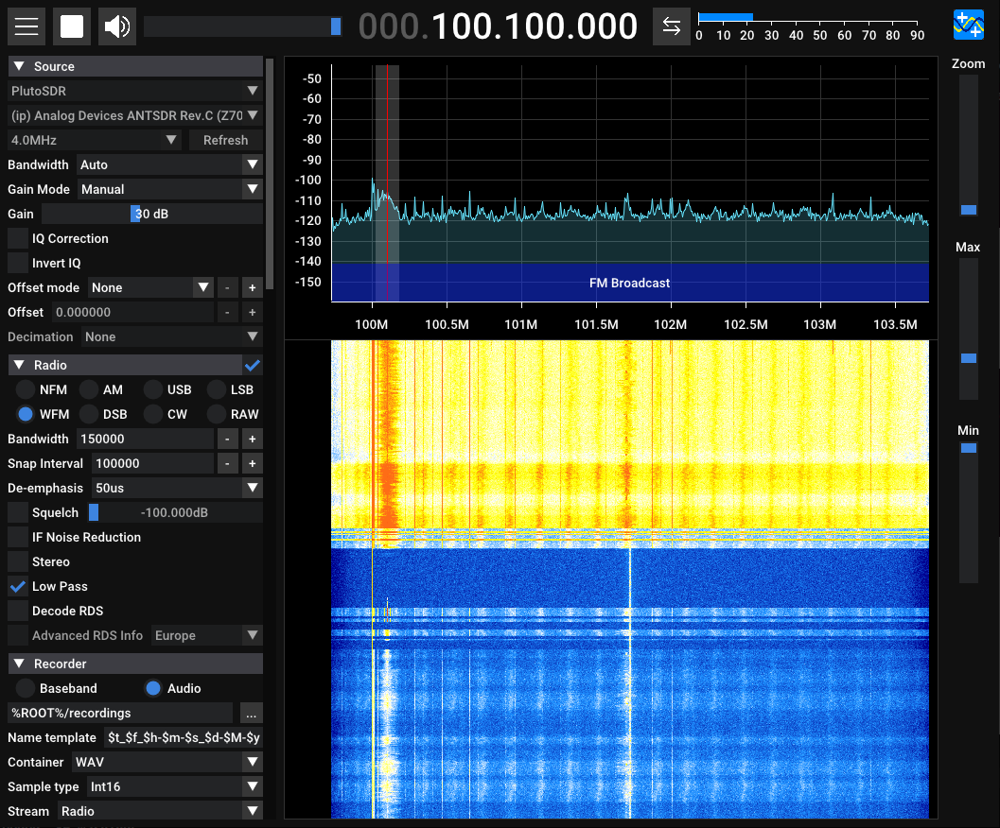

## E316 Unboxing and Inspection
[[中文]](../../../cn/device_and_usage_manual/ANTSDR_E_Series_Module/ANTSDR_E316_Reference_Manual/AntsdrE316_Unpacking_examination_cn.html)

### 1. Overview

The E316 is a software-defined radio (SDR) designed for professional applications, supporting wideband RF signal transmission and reception from 70 MHz to 6 GHz. It can operate as a USB peripheral or run standalone via programmable control. After two generations of refinement, the E316 features enhanced transmit power, improved receive sensitivity, lower noise floor and phase noise, and a more comprehensive wireless application interface. ANTSDR has accumulated a wealth of successful application cases in fields such as spectrum monitoring, UAVs, GPS, and radio signal analysis.


### 2. Package Contents

Thank you for purchasing the ANTSDR series SDR platform from Weixiang Technology Co., Ltd.
Upon receiving your ANTSDR E316 (Standard Edition), please open the accessory pack. The following items should be included:

- ANTSDR Software-Defined Radio: ×1
- USB Data Cables: ×2
- Rubber Antennas: ×2
- Tray Antenna: ×1
- Ethernet Cable: ×1
- 32GB SD Card X1

### 3. Listen to the radio using **Pluto firmware**

The DIP switch for selecting the boot mode is located below the Ethernet port and is labeled "BOOT/QSPI/SD".
ANTSDR E316 comes pre-installed with Pluto firmware in QSPI memory. QSPI boot is Pluto firmware, SD card boot is UHD firmware

When the device boots successfully, the green status LED will flash.

If Pluto firmware is not installed on the device ，You can download and burn it from [GitHub Download](https://github.com/MicroPhase/antsdr-fw-patch/releases).

The default configuration of Pluto firmware is as follows:

- **IP Address**: 192.168.1.10
- **Username / Password**: root / analog
- **Baud Rate**: 115200

#### ● Windows 

[Download PlutoSDR Drivers](https://wiki.analog.com/university/tools/pluto/drivers/windows)

[Download Serial Drivers](https://ftdichip.com/wp-content/uploads/2021/08/CDM212364_Setup.zip)

○1. Install Windows drivers： **CDM212364_Setup.exe** and **PlutoSDR-M2K-USB-Drivers.exe**.

Then, connect one end of the network cable to the ANTSDR device and the other end to your computer. Connect the antenna to the RX1 port.


○2.After that, you should be able to see the PlutoSDR device in **Computer Management → Device Manager**.

If the device is not displayed, please check the following items:

- Is the firmware burned successfully
- Is the driver installed correctly
- Is the USB OTG correctly inserted


○3.Configure the local IP address, subnet mask, and default gateway. Ensure the local IP address is within the same subnet as the ANTSDR, for example: `192.168.1.100`. Set the subnet mask to `255.255.255.0` and the default gateway to `192.168.1.1`.

○4. The default IP address of the ANTSDR device is `192.168.1.10`.
 Open a **CMD** window and execute the following command to check connectivity:


○5. Receiving Broadcast Signals

Run the **SDRSharp.exe** file in Windows to start listening to the radio.


The ANTSDR device IP is `192.168.1.10`


Once connected, select a radio frequency channel to begin listening.


#### ● Linux

○1.  The default IP address of the Pluto firmware is `192.168.1.10`. Set your local IP address to `192.168.1.100`, and then ping `192.168.1.10` to check the connection.


○2. For **libiio** installation, see the [official guide](https://wiki.analog.com/resources/eval/user-guides/ad-fmcdaq2-ebz/software/linux/applications/libiio)，or refer to the [《E316 GNU Radio》](./AntsdrE316_gnurdio.md)。


○3.  If **libiio** has already been installed, run the following command to verify device detection:

```
iio_info -s
```


The device can be connected via USB OTG.
Once connected, launch the **SDR++** software.
After a successful connection, you can begin listening to radio signals.


