## U200 Unboxing and Inspection

[[中文]](../../../cn/device_and_usage_manual/ANTSDR_U_Series_Module/ANTSDR_U200_Reference_Manual/AntsdrU200_Unpacking_examination_cn.html)

### 1. Overview

The U200 is a software-defined radio (SDR) platform designed to meet the needs of makers, radio enthusiasts, and professional users. It supports wideband RF transceiving from 325 MHz to 3.8 GHz, enabling a variety of modulation and signal processing applications. With strong support from open-source projects and comprehensive learning resources, it significantly lowers the barrier to SDR development.

The U200 can serve as a practical alternative to the USRP B205 in many use cases. It offers standardized driver interfaces and is compatible with popular software platforms such as GNU Radio and SDRangel. Combining high performance with excellent cost-effectiveness, the U200 is an ideal SDR platform for research, education, and industrial applications.


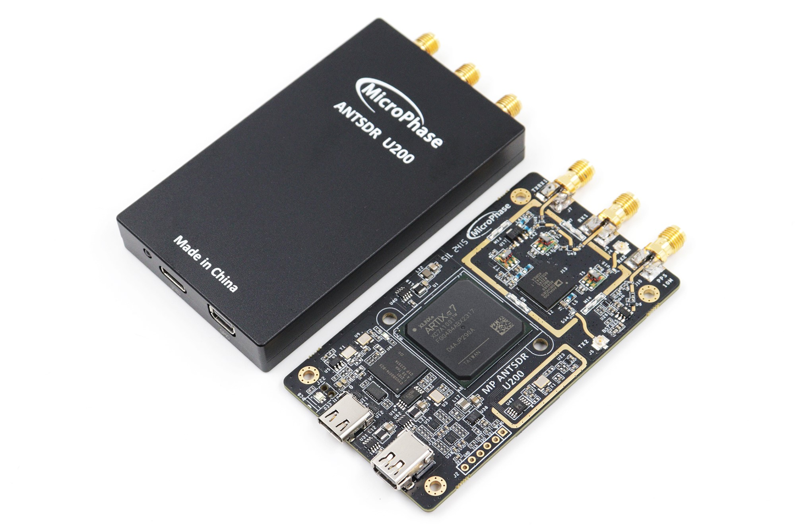

### 2. Item List

Thank you for purchasing the ANTSDR series software-defined radio platform from MicroPhase Technology Co., Ltd. Upon receiving your ANTSDR U200 (Standard Edition), please open the accessory package, which should include the following items

- ANTSDR Software-Defined Radio: ×1

- USB Data Cable: ×1

- Short Rubber Antennas: ×2

- Tray Antenna: ×1

After unpacking, the next step is to verify the SDR device model

### Windows

The unboxing process for the U200 is similar to that of the U220.
ANTSDR runs firmware compatible with USRP UHD, and during use, it is primarily operated through software that supports the USRP B210. First, connect the device to your computer via a USB 3.0 port—these are usually marked in blue, though this may vary depending on the computer model. Then, right-click on the Start Menu and open Device Manager.

In the "Other Devices" section, you should see a device named WestBridge, indicating that the USB driver is not yet installed. Inside the provided documentation under the firmware directory, you will find a compressed file named erllc_uhd_winusb_driver. Extract it to obtain the installer package.


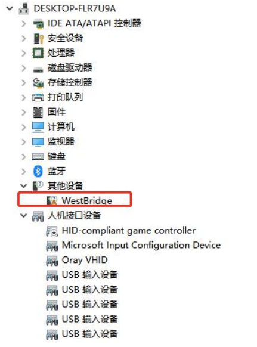

After installing the USB device, the next step is to install the UHD driver.
In the provided firmware directory, locate the windows folder and right-click the application to run it as administrator.


This indicates that the USB driver has been successfully installed .


#### UHD Driver Installation

After installing the USB device, the next step is to install the UHD driver.
In the provided firmware directory, locate the windows folder and right-click the application to run it as administrator.

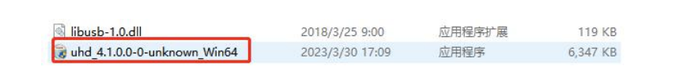

Select the option to add UHD to the system environment variables.

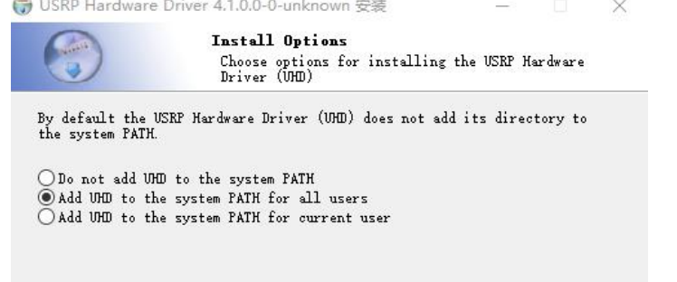

You should now see the UHD firmware in the Program Files directory on drive C.
Copy the libusb-1.0.dll file (as shown in the image) to the UHD/bin directory.


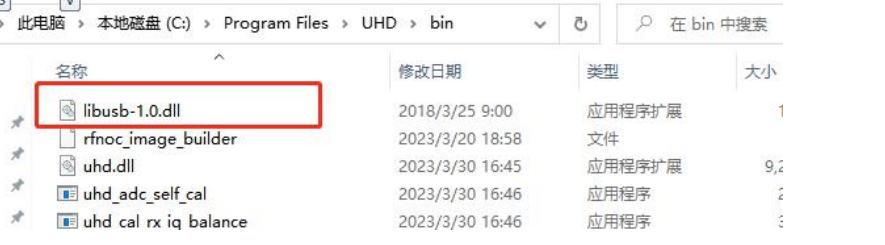

Next, go to the UHD/share directory and create a new folder named image.
Copy the usrp_b200_fw.hex file (as shown in the image) into the image folder.

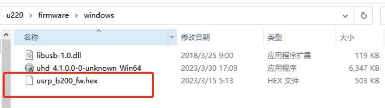

Then, copy the usrp_b210_fpga.bin firmware file for the U220 into the same image folder.Edit your system environment variables to add the full path of the image folder to the system PATH.

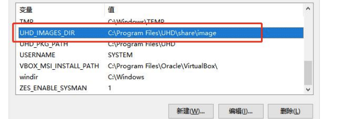

In the UHD/bin directory, connect the device to a USB 3.0 port on your PC, then open a command prompt.

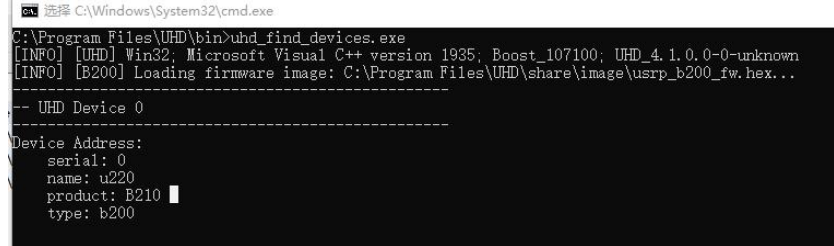

Next, run the following command:
```
uhd_usrp_probe.exe 
```
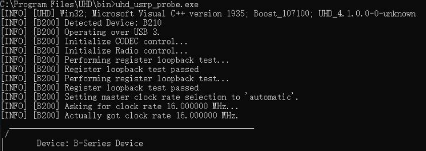

#### Software Test

After completing the driver installation, we proceed to test the U220.
We use an open-source SDR application called sdrAngel for testing.
The installation package for sdrAngel is already included in the windows folder provided by MicroPhase.


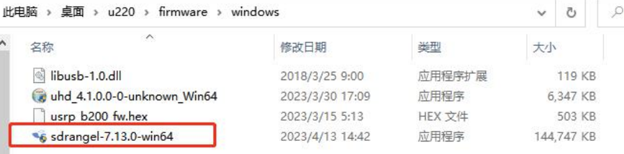

Copy uhd.dll in UHD/bin to the installation directory of sdrangel and replace the original uhd.dll

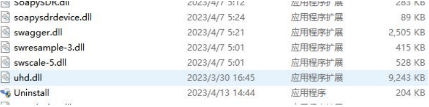

Open sdrangel


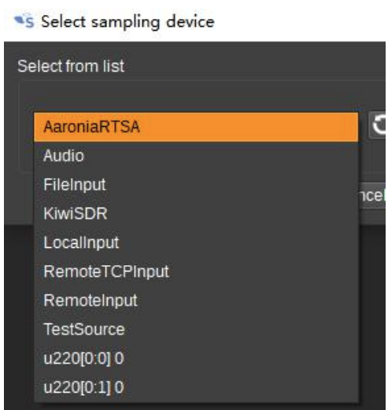

If there is no u220 device, please check whether the driver is installed successfully and whether the device is powered and restart the software.

After successful connection, select RX2 as the receiver and select the center frequency. Here we can test the device through FM radio stations

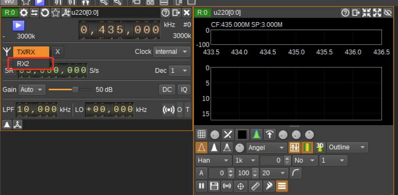

After the setup is complete, start the device

Then add an FM demodulator


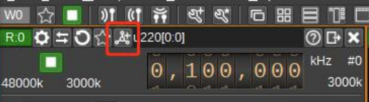

Select Broadcast FM Demodulator

At this point, you can hear the sound, but it is not clear, so you need to adjust the receiving frequency to the radio signal. In my case, there is a radio station at 100.1Mhz.

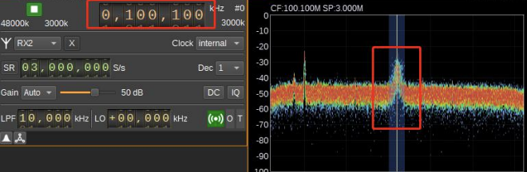

Next, you can hear the sound from the radio. At this point, the unpacking test is complete.

### ubuntu


You can find this project on GitHub: [ANTSDR UHD](https://github.com/MicroPhase/antsdr_uhd/blob/master/host/README.md). Different versions have different differences.

### Build on Ubuntu
#### Build Dependencies
You can install all the dependencies through the package manager:

```
sudo apt-get install autoconf automake build-essential ccache cmake cpufrequtils doxygen ethtool \
g++ git inetutils-tools libboost-all-dev libncurses5 libncurses5-dev libusb-1.0-0 libusb-1.0-0-dev \
libusb-dev python3-dev python3-mako python3-numpy python3-requests python3-scipy python3-setuptools \
python3-ruamel.yaml
```

#### Build Instructions
- **Generate Makefile with CMake**
```
cd host/
mkdir build
cd build
cmake -DENABLE_X400=OFF -DENABLE_N320=OFF -DENABLE_X300=OFF -DENABLE_USRP2=OFF -DENABLE_USRP1=OFF -DENABLE_N300=OFF -DENABLE_E320=OFF -DENABLE_E300=OFF ../
```
- **Make**
```
make
```
- **Install**
```
sudo make install
sudo ldconfig
```
The default installation path: `/usr/local/lib/uhd`
#### Download Firmware

After installing uhd, next, run the following command to download the firmware required by the device

```
cd /usr/local/lib/uhd/utils
sudo ./uhd_images_downloader.py
```

#### Replace firmware
Replace the **usrp_b205mini_fpga.bin**  firmware of U200 in the /usr/local/share/uhd/images/ directory

### Test with U220
run the command `uhd_usrp_probe`. An example output is shown below:
```
wu@wu-System-Product-Name:~$ uhd_usrp_probe 
[INFO] [UHD] linux; GNU C++ version 11.4.0; Boost_107400; UHD_4.1.0.0-0-45cabfde
[INFO] [B200] Loading firmware image: /usr/local/share/uhd/images/usrp_b200_fw.hex...
[INFO] [B200] Detected Device: B210
[INFO] [B200] Loading FPGA image: /home/wu/usrp_b210_fpga.bin...
[INFO] [B200] Operating over USB 3.
[INFO] [B200] Detecting internal GPSDO.... 
[INFO] [GPS] Found a generic NMEA GPS device
[INFO] [B200] Initialize CODEC control...
[INFO] [B200] Initialize Radio control...
[INFO] [B200] Performing register loopback test... 
[INFO] [B200] Register loopback test passed
[INFO] [B200] Performing register loopback test... 
[INFO] [B200] Register loopback test passed
[INFO] [B200] Setting master clock rate selection to 'automatic'.
[INFO] [B200] Asking for clock rate 16.000000 MHz... 
[INFO] [B200] Actually got clock rate 16.000000 MHz.
  _____________________________________________________
 /
|       Device: B-Series Device
|     _____________________________________________________
|    /
|   |       Mboard: B210
|   |   serial: U220200
|   |   name: u220v2
|   |   product: 30740
|   |   FW Version: 8.0
|   |   FPGA Version: 16.0
|   |   
|   |   Time sources:  none, internal, external, gpsdo
|   |   Clock sources: internal, external, gpsdo
|   |   Sensors: gps_gpgga, gps_gprmc, gps_time, gps_locked, gps_servo, ref_locked
|   |     _____________________________________________________
|   |    /
|   |   |       RX DSP: 0
|   |   |   
|   |   |   Freq range: -8.000 to 8.000 MHz
|   |     _____________________________________________________
|   |    /
|   |   |       RX DSP: 1
|   |   |   
|   |   |   Freq range: -8.000 to 8.000 MHz
|   |     _____________________________________________________
|   |    /
|   |   |       RX Dboard: A
|   |   |     _____________________________________________________
|   |   |    /
|   |   |   |       RX Frontend: A
|   |   |   |   Name: FE-RX2
|   |   |   |   Antennas: TX/RX, RX2
|   |   |   |   Sensors: temp, rssi, lo_locked
|   |   |   |   Freq range: 50.000 to 6000.000 MHz
|   |   |   |   Gain range PGA: 0.0 to 76.0 step 1.0 dB
|   |   |   |   Bandwidth range: 200000.0 to 56000000.0 step 0.0 Hz
|   |   |   |   Connection Type: IQ
|   |   |   |   Uses LO offset: No
|   |   |     _____________________________________________________
|   |   |    /
|   |   |   |       RX Frontend: B
|   |   |   |   Name: FE-RX1
|   |   |   |   Antennas: TX/RX, RX2
|   |   |   |   Sensors: temp, rssi, lo_locked
|   |   |   |   Freq range: 50.000 to 6000.000 MHz
|   |   |   |   Gain range PGA: 0.0 to 76.0 step 1.0 dB
|   |   |   |   Bandwidth range: 200000.0 to 56000000.0 step 0.0 Hz
|   |   |   |   Connection Type: IQ
|   |   |   |   Uses LO offset: No
|   |   |     _____________________________________________________
|   |   |    /
|   |   |   |       RX Codec: A
|   |   |   |   Name: B210 RX dual ADC
|   |   |   |   Gain Elements: None
|   |     _____________________________________________________
|   |    /
|   |   |       TX DSP: 0
|   |   |   
|   |   |   Freq range: -8.000 to 8.000 MHz
|   |     _____________________________________________________
|   |    /
|   |   |       TX DSP: 1
|   |   |   
|   |   |   Freq range: -8.000 to 8.000 MHz
|   |     _____________________________________________________
|   |    /
|   |   |       TX Dboard: A
|   |   |     _____________________________________________________
|   |   |    /
|   |   |   |       TX Frontend: A
|   |   |   |   Name: FE-TX2
|   |   |   |   Antennas: TX/RX
|   |   |   |   Sensors: temp, lo_locked
|   |   |   |   Freq range: 50.000 to 6000.000 MHz
|   |   |   |   Gain range PGA: 0.0 to 89.8 step 0.2 dB
|   |   |   |   Bandwidth range: 200000.0 to 56000000.0 step 0.0 Hz
|   |   |   |   Connection Type: IQ
|   |   |   |   Uses LO offset: No
|   |   |     _____________________________________________________
|   |   |    /
|   |   |   |       TX Frontend: B
|   |   |   |   Name: FE-TX1
|   |   |   |   Antennas: TX/RX
|   |   |   |   Sensors: temp, lo_locked
|   |   |   |   Freq range: 50.000 to 6000.000 MHz
|   |   |   |   Gain range PGA: 0.0 to 89.8 step 0.2 dB
|   |   |   |   Bandwidth range: 200000.0 to 56000000.0 step 0.0 Hz
|   |   |   |   Connection Type: IQ
|   |   |   |   Uses LO offset: No
|   |   |     _____________________________________________________
|   |   |    /
|   |   |   |       TX Codec: A
|   |   |   |   Name: B210 TX dual DAC
|   |   |   |   Gain Elements: None

```