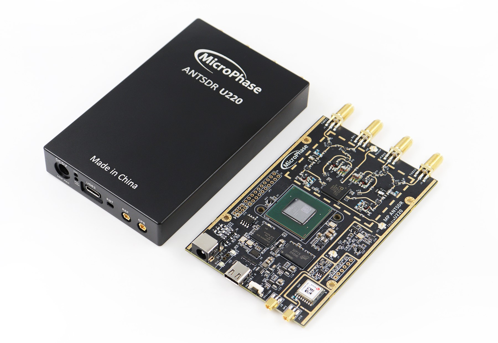

## U220 Hardware Manual

[[中文]](../../../cn/device_and_usage_manual/ANTSDR_U_Series_Module/ANTSDR_U220_Reference_Manual/AntsdrU220_Reference_Manual_cn.html)

### Overview

Unlike the ANTSDR E series, the U series adopts a USB 3.0 interface with an instantaneous transfer rate of 5 Gbps, which easily supports the maximum bandwidth of the AD9361. The baseband chip is the Xilinx Artix-7 XC7A200T, offering greater logic resources and faster processing speed. It also adds data buffering capabilities, significantly reducing packet loss during high-bandwidth data transmission and ensuring more stable data transfer.

### Hardware Resources

- Xilinx Artix-7 XC7A200T
- Analog Devices AD9361/9363 
- TYPE-C USB3.0  connector
- 20-Pin 2.54mm GPIO expansion port
- 6-Pin 2.54mm JTAG expansion port
- 1 external PPS/10MHz reference entrance
- 1 GPS sync input interface
- 2 transmit channels and 2 receive channels, supporting half-duplex or full-duplex operation.
- Flexible sampling rate 12-bit ADC and DAC
- Integrated RF front-end (AD9361: 70 MHz – 6 GHz, AD9363: 325 MHz – 3.8 GHz)
- Tunable analog bandwidth (AD9361: 200 kHz – 56 MHz, AD9363: 200 kHz – 20 MHz)

