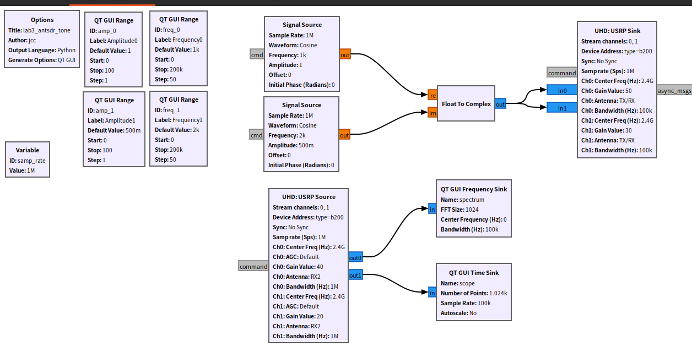
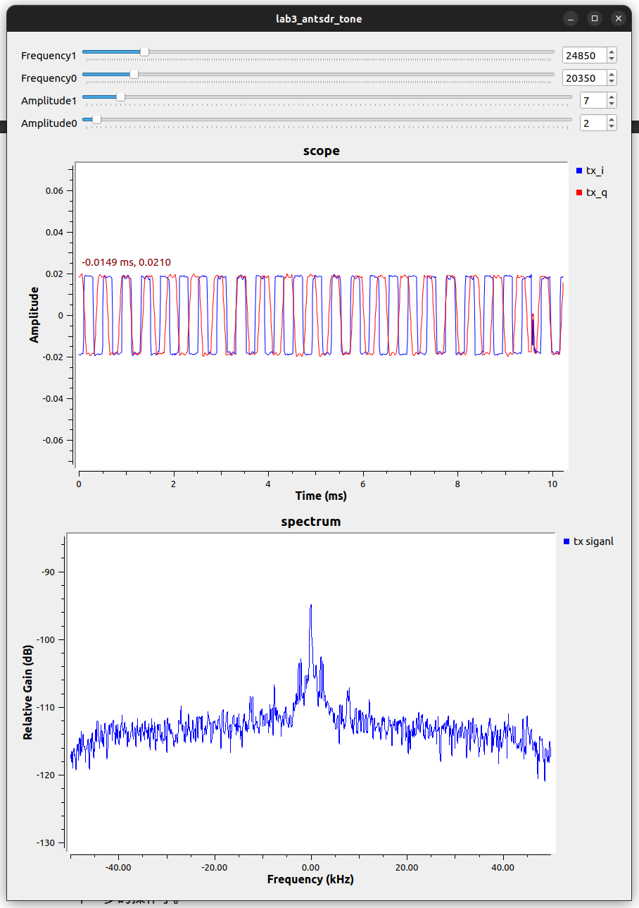

## U220 Gnu Radio

[[中文]](../../../cn/device_and_usage_manual/ANTSDR_U_Series_Module/ANTSDR_U220_Reference_Manual/AntsdrU220_gnuradio_cn.html)

### Overview

**[GNU Radio](https://www.gnuradio.org/)** is a free and open-source software development toolkit that provides signal processing blocks for implementing software-defined radios and signal processing systems. It can be used with external RF hardware to create software-defined radio systems or without hardware in a simulation-like environment. GNU Radio is widely used in amateur, academic, and commercial settings to support wireless communications research and the development of real-world radio systems.

GNU Radio offers a comprehensive framework for developing and running software radios and signal processing applications. These applications, often called "flowgraphs", are composed of interconnected signal processing blocks, which are a series of signal processing blocks connected together, describing the flow of data. These flowgraphs can be written in C++ or Python programming languages. The GNU Radio infrastructure is written entirely in C++, while many user tools are written in Python.

As with all software-defined radio systems, reconfigurability is a key feature. GNU Radio's open interfaces make it easy to integrate users' own radio equipment into the GNU Radio ecosystem without designing for specific hardware.


### Installing System Packages
Before installing the Pluto SDR driver, make sure to install the required dependencies using the following commands:
```
sudo apt install git cmake g++ libboost-all-dev libgmp-dev swig python3-numpy python3-mako python3-sphinx python3-lxml doxygen libfftw3-dev libsdl1.2-dev libgsl-dev libqwt-qt5-dev libqt5opengl5-dev python3-pyqt5 liblog4cpp5-dev libzmq3-dev python3-yaml python3-click python3-click-plugins python3-zmq python3-scipy python3-gi python3-gi-cairo gir1.2-gtk-3.0 libcodec2-dev libgsm1-dev
```

Installing Gnu Radio from source
```
git clone https://github.com/gnuradio/gnuradio.git
cd gnuradio
git checkout maint-3.8
git submodule update --init --recursive
mkdir build
cd build
cmake -DCMAKE_BUILD_TYPE=Release -DPYTHON_EXECUTABLE=/usr/bin/python3 ../
make
sudo make install
sudo ldconfi
```
Next, add the environment variables:
```
gedit ~/.bashrc
```
Add in the last line
```
export PYTHONPATH=/usr/local/lib/python3/dist-packages:/usr/local/lib/python3.8/dist-packages:$PYTHONPATH
export LD_LIBRARY_PATH=/usr/local/lib:$LD_LIBRARY_PATH
```
After the installation is complete, you can open
```
gnuradio-companion
```
Open the flow chart in the data for testing



If the execution fails, please confirm whether you have correctly installed GNU Radio and whether you have USB 3.0 permissions.

The test results are shown in the figure


