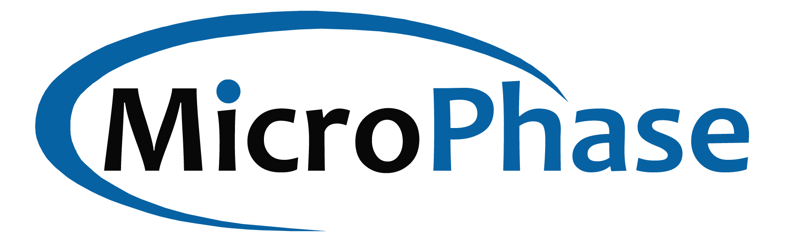

## 公司介绍

微相科技（上海）有限公司（简称微相科技，英文：MicroPhase）坐落在东方的世界明珠上海市，专注于嵌入式软硬件系统的开发与方案提供，我们的产品以FPGA，ARM处理器为核心的模块产品和系统级板卡，我们注重客户的应用，以应用为导向，倾听客户严苛的应用需求，为客户提供高可靠性和稳定性的嵌入式系统和定制化解决方案。我们坚信客户的成功就是我们的成功。

微相科技产品广泛应用在各个领域，我们的应用领域包括：运动控制器及工业网络，网络通信与数据加速，视频与图像处理，嵌入式机器视觉，半导体，科研等微相科技坚持以客户应用需求为导向，为客户提供嵌入式系统解决方案。除了标准产品和定制产品外，微相科技也可以根据客户需求产品一站式解决方案。

## 联系我们

- 📞电话: 021-50902227

-  📧邮箱: <sales@microphase.cn>

-  💻网址:<http://www.microphase.cn>

-  🏢地址: 上海市川宏路230号2号楼3楼

