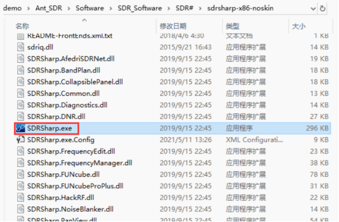

## E200 开箱检测

[[English]](../../../../device_and_usage_manual/ANTSDR_E_Series_Module/ANTSDR_E200_Reference_Manual/AntsdrE200_Unpacking_examination.html)

### 1. 概述

E200 是一款面向创客和SDR爱好者同时也可以满足专业应用场景的软件无线电,支持70 MHz 到 6 GHz 的宽频段射频信号收发，可以通过千兆网对其进行控制，也可以通过编程实现脱机运行。众多的开源项目支持和学习教程，让客户接触更多应用成为可能。

### 2. 物品清单

感谢您购买微相科技有限公司的 ANTSDR 系列软件无线电平台，当您拿到ANTSDR E200（标准版）之后，打开配件包，其中应包含如下内容，

- ANTSDR 软件无线电: X1

- USB 数据线: X1 

- 胶棒天线: X2

- 读卡器: X1

- 网线: X1

- 32GB SD 卡 X1

打开包装后，开始开箱检查

### 3. ANTSDR 驱动软件安装

接下来使用**pluto固件**收听广播。

ANTSDR E200出厂默认的固件有Pluto固件和UHD固件，出厂时，已经将pluto固件烧写到qspi 中，收听广播需要使用pluto固件，则只需要将拨码开关设置为qspi启动。或者您可以下载pluto固件到SD卡，用SD卡启动E200也是可行的

如果您没有pluto固件，可以从github下载：[下载Pluto固件](https://github.com/MicroPhase/antsdr-fw-patch/releases)。

E200 出厂时已将 Pluto 固件烧录到 QSPI 中。因此，使用 Pluto 固件相对简单。Pluto 固件默认 IP 地址为 `192.168.1.10` ，用户名和密码为 `root analog` ，波特率为 `115200` 。

设置启动模式的DIP开关在网口下方，在外壳的网口下方可以清晰的看到BOOT QSPI SD的字样。将拨码开关设置为QSPI启动，启动后会看到绿灯闪烁

### ● Windows 系统

○1. 安装 Windows 驱动程序： 

如果您需要登录到串口看系统启动日志，需要安装CH340串口驱动，E200的串口使用的CH340芯片作为串口芯片，在资料文件夹中，可以找到CH340驱动并进行安装即可

将网线一端连接到ANTSDR，另一端连接到电脑。连接天线到RX1端口

○2.在您电脑的网络适配器中，依次设置本机IP地址、子网掩码、网关。本机IP地址设置为与ANTSDR同一网段，例如 `192.168.1.100` 。子网掩码设置为 `255.255.255.0` ，默认网关设置为 `192.168.1.1` 。

○4. ANTSDR 设备IP为 `192.168.1.10` ，此时需要打开cmd窗口， `ping 192.168.1.10`

○5. 收听广播

在 Windows 中运行 SDRSharp.exe 文件来收听广播

ANTSDR 设备IP为 `192.168.1.10 `

连接成功后，选择广播频道，开始收听广播。

### ● Linux 系统

○1. pluto 固件默认 ip 为 `192.168.1.10` ，将本地 ip 地址设置为  `192.168.1.100 ` ，然后  `ping 192.168.1.100` 。

○2. 您可以参考此链接来安装[libiio](https://wiki.analog.com/resources/eval/user-guides/ad-fmcdaq2-ebz/software/linux/applications/libiio#:~:text=Libiio%20is%20a%20library%20that%20has%20been%20developed,of%20software%20interfacing%20Linux%20Industrial%20I%2FO%20%28IIO%29%20devices.)

或者

您可以在以下位置找到安装 libiio 的详细步骤 [ANTSDR E200 GNU Radio](./AntsdrE200_gnurdio_cn.md)

○3. 如果已经安装了libiio，执行 `iio_info -s`

可以通过千兆以太网链接
打开 sdr++ 软件。
连接成功后，即可开始收听广播。

