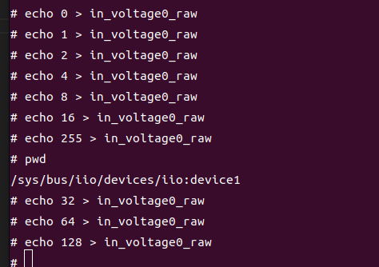

## 设置gpio

[[English]](../../../../device_and_usage_manual/ANTSDR_E_Series_Module/ANTSDR_E200_Reference_Manual/set_gpio.html)


### Pluto Firmware
E200 有 8 个用户可操作的 GPIO。至于如何使用这 8 个 GPIO，可以使用下面的方法。在 Pluto 固件中使用 GPIO，就像直接操作 EMIO 一样。这种方法简单直接。
```
#!/bin/bash

START=995
END=1002

for i in $(seq $START $END); do
  echo $i > /sys/class/gpio/export 2>/dev/null
  echo out > /sys/class/gpio/gpio$i/direction
done

echo "Flip 995~1002..."

while true; do
  for i in $(seq $START $END); do
    echo 1 > /sys/class/gpio/gpio$i/value
  done
  sleep 0.5
  for i in $(seq $START $END); do
    echo 0 > /sys/class/gpio/gpio$i/value
  done
  sleep 0.5
done
```
还有一种操作gpio的方式，只在release[v0.34](https://github.com/MicroPhase/antsdr-fw-patch/releases/tag/v0.34)固件中支持 

通过串口登录开发板系统：

```
Welcome to ANTSDR
ant login: root
Password: 
Welcome to:
    ___    _   _____________ ____  ____ 
   /   |  / | / /_  __/ ___// __ \/ __ \
  / /| | /  |/ / / /  \__ \/ / / / /_/ /
 / ___ |/ /|  / / /  ___/ / /_/ / _, _/ 
/_/  |_/_/ |_/ /_/  /____/_____/_/ |_|  
                                       
v0.34-dirty
https://github.com/MicroPhase/antsdr-fw
# 
# iio_attr -d
IIO context has 6 devices:
  iio:device0, ad9361-phy: found 18 device attributes
  iio:device1, mp-gpio: found 0 device attributes
  iio:device2, xadc: found 1 device attributes
  iio:device3, ref-pll: found 0 device attributes
  iio:device4, cf-ad9361-dds-core-lpc: found 0 device attributes
  iio:device5, cf-ad9361-lpc: found 0 device attributes
```
看到以下设备
```
  iio:device1, mp-gpio: found 0 device attributes
```
进入设备目录
```
# cd /sys/bus/iio/devices/iio\:device1/
# ls
dev              in_voltage1_raw  of_node          subsystem
in_voltage0_raw  name             power            uevent

```
in_volting0_raw可以控制 gpio 状态，
in_volting1_raw可以控制 gpio 方向

使用如图所示的方式设置 gpio



8个gpio中，每个gpio对应其二进制数