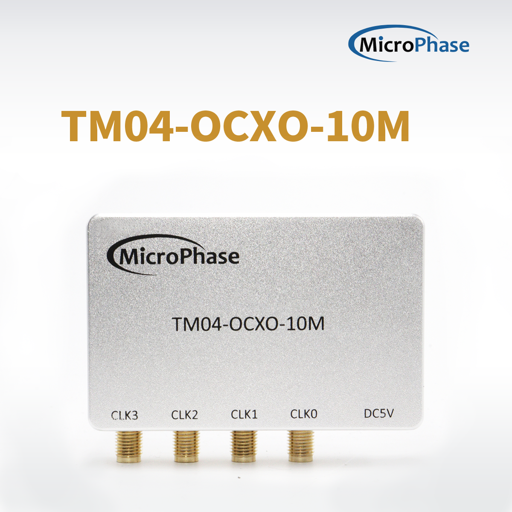
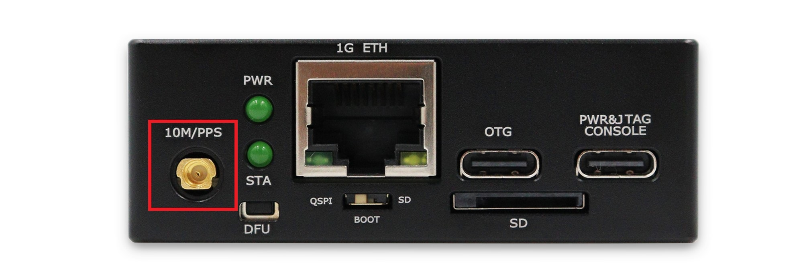

## ANTSDR 时钟校准

[[English]](../../../../device_and_usage_manual/ANTSDR_E_Series_Module/ANTSDR_E310_Reference_Manual/Antsdr-Clock-calibration.html)

⽤⼾需要进⼊系统对iio设备⽂件进⾏操作，或者在上位机通过libiio接口访问名字为`ad5660mp`的iio设备。这⾥通过进⼊系统来校准时钟。
### 准备

使用前需准备：

一个10M时钟



一根SMA 转 MMCX 连接线



将 SMA 转 MMCX 线缆的一端连接到 ANTSDR 的 **10/PPS** 端口，另一端连接到10M时钟上。

### ad5660mp

⾸先通过串口进⼊系统，设备⽤⼾名**root**，密码**analog**。

```
ant login: root
Password: 
Welcome to:
    ___    _   _____________ ____  ____ 
   /   |  / | / /_  __/ ___// __ \/ __ \
  / /| | /  |/ / / /  \__ \/ / / / /_/ /
 / ___ |/ /|  / / /  ___/ / /_/ / _, _/ 
/_/  |_/_/ |_/ /_/  /____/_____/_/ |_|  
                                       
v0.39-1-g7bcc-dirty
https://github.com/MicroPhase/antsdr-fw-patch

```
您可以使用以下命令查看iio设备：

```
iio_attr -d
```
可以看到有一个名为`ad5660mp`的iio设备，接下来进入这个目录。
```

# iio_attr -d
IIO context has 6 devices:
	hwmon0, e000b000ethernetffffffff00: found 0 device attributes
	iio:device0, ad5660mp: found 1 device attributes
	iio:device1, ad9361-phy: found 19 device attributes
	iio:device2, xadc: found 2 device attributes
	iio:device3, cf-ad9361-dds-core-lpc: found 3 device attributes
	iio:device4, cf-ad9361-lpc: found 3 device attributes

```
```
# cd /sys/bus/iio/devices/iio:device0
# ls
in_voltage_dac_locked      name
in_voltage_dac_mode        of_node
in_voltage_dac_read_value  power
in_voltage_dac_ref_sel     subsystem
in_voltage_dac_value       uevent
in_voltage_raw             waiting_for_supplier
```

可以看到如下属性，接下来我们分别介绍一下以下属性的作用。

```
in_voltage_dac_mode         0: Automatic setting. 1: Manual setting. Default is 1
in_voltage_dac_value        Write the value of dac
in_voltage_dac_read_value   Mode 1 User set DAC value Mode 0 External reference calibrated DAC value (23000)
in_voltage_dac_ref_sel      0:10M 1:PPS 2:GPS 
in_voltage_dac_locked       PLL lock status
```
默认状态为手动设置，DAC值为`23000`，可以通过`cat`命令查看。

```
# cat in_voltage_dac_mode
1
# cat in_voltage_dac_read_value
23000

```
### 自动设置

10M自动锁定配置，输入以下命令将DAC配置为自动状态10M锁定，使用这种方式时，需要逐个执行命令，输入完后按`Ctrl+C`回车退出，可以使用`cat`命令检查是否设置成功。
```
echo 0 > in_voltage_dac_mode
echo 0 > in_voltage_dac_ref_sel

```

PPS自动锁定配置

```
echo 0 > in_voltage_dac_mode
echo 1 > in_voltage_dac_ref_sel
```

GPS自动锁定配置

```
echo 0 > in_voltage_dac_mode
echo 2 > in_voltage_dac_ref_sel
```

等待几十秒，锁定后可以通过`cat in_voltage_dac_locked` 查看。

```
# cat in_voltage_dac_locked 
1

```
### 手动设置

手动设置模式并写入值。

```
echo 1 > in_voltage_dac_mode
echo 23000 > in_voltage_dac_value
```