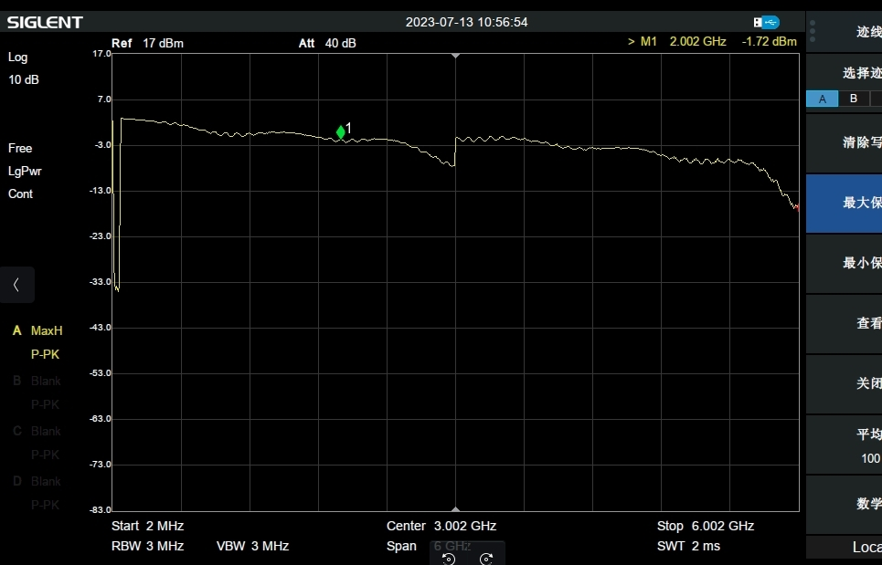
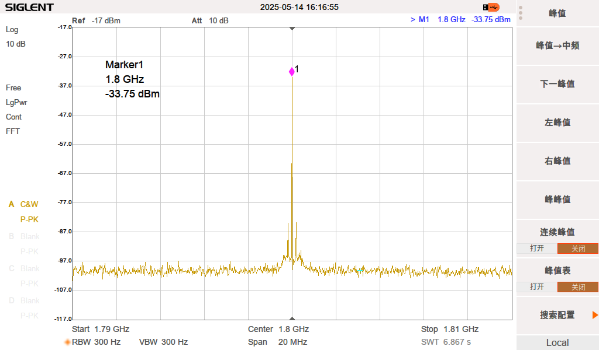

## E310 RF 

[[English]](../../../../device_and_usage_manual/ANTSDR_E_Series_Module/ANTSDR_E310_Reference_Manual/AntsdrE310_RF_parameters.html)

### E310 TX 功率

AD9361是一款面向3G和4G基站应用的高性能、高集成度的射频 (RF) Agile Transceiver™捷变收发器。该器件的可编程性和宽带能力使其成为多种收发器应用的理想选择。该器件集RF前端与灵活的混合信号基带部分为一体，集成频率合成器，为处理器提供可配置数字接口，从而简化设计导入。AD9361接收器LO工作频率范围为70 MHz至6.0 GHz，发射器LO工作频率范围为47 MHz至6.0 GHz，涵盖大部分特许执照和免执照频段，支持的通道带宽范围为200 kHz以下至56 MHz。

### TX1 中心频率为1.8G，发射单一信号测试

### RX 隔离度测试

RX在增益设置为手动增益，设置为0的情况下,隔离度大于50db

RX1:

RX2

### TX - RX 隔离度测试 

TX输出为0dbm，且rx增益为 0 的情况下，两者隔离度均大于75db

RX1：

RX2：

### TX - TX 隔离度测试

TX衰减都为0的情况下，隔离度大于60db

### AD9361 数据手册

您可以在此处找到 AD9361 数据手册：[Data Sheet](https://www.analog.com/en/products/ad9361.html)

### ANTSDR 选型

| Signal Name                      | E200                        | E310                     | E316                            |
| -------------                    | ----------                  | --------------           | ----------                      | 
| RFIC                             | AD9361/3                    |   AD9361/3               |AD9361/3                         | 
| RF channel                       | SMA:1T1R IPEX:1T1R          |2T2R MIMO                 |2T2R MIMO                        |
| Instantaneous bandwidth          |56M (9361), 20M (9363)       |56M (9361), 20M (9363)    |56M (9361), 20M (9363)           |
| FPGA/SoC                         | ZYNQ XC7Z020                | ZYNQ XC7Z020             |ZYNQ XC7Z020                     |
| DDR3                             |PS 512MB                     | PS 1GB                   | PS 1GB                          |  
| Host Interface                   | 1G ETH                      | 1G ETH                   |1G ETH                           |        
| Transmission bandwidth to host   | 20MSPS                      | 10MSPS                   | 20MSPS                          |        
|Clock synchronization             | 10M/PPS                     | 10M/PPS                  | 10M/PPS                         |   
| API                              | Libiio & UHD /C/C++ /PYTHON | Libiio &  C/C++ /PYTHON  |   Libiio & UHD & C/C++ /PYTHON  |     

