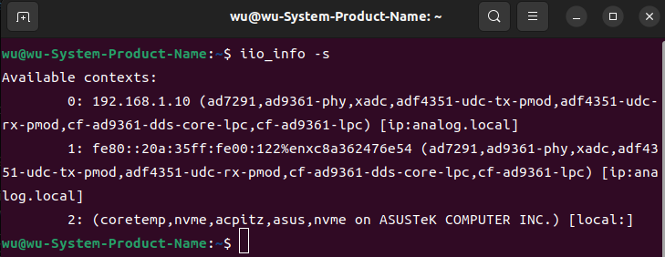

## E310 FMCOMMS 固件

[[English]](../../../../device_and_usage_manual/ANTSDR_E_Series_Module/ANTSDR_E310_Reference_Manual/AntsdrE310_fmcomms.html)


您可以在GitHub上找到此项目的地址, [ANTSDR FMCOMMS](https://github.com/MicroPhase/antsdr_fmcomms) ,不同版本有不同的区别。

### 1. 概述

ANTSDR FMCOMMS2/3/4 固件可支持 2t2r 61.44Msps 采样率

### 2. 下载固件 

首先下载 FMCOMMS 固件

[下载 image-ADI-Kuiper-full.zip](https://wiki.analog.com/resources/tools-software/linux-software/adi-kuiper_images/release_notes)

[ADI AD-FMCOMMS3-EBZ 用户手册](https://wiki.analog.com/resources/eval/user-guides/ad-fmcomms3-ebz#:~:text=The%20AD-FMComms3-EBZ%20is%20an%20FMC%20board%20for%20the,be%20found%20on%20the%20the%20ADI%20web%20site)

### 3. FMCOMMS 固件

#### 3.1 烧写镜像

##### ●Windows 用户

用户解压后，就可以使用镜像刻录工具将其刻录到SD卡上。

首先需要准备一张32GB的SD卡，并将其格式化为FAT32，用户选择的SD卡容量需大于固件的大小。

[Download win32diskimager](https://sourceforge.net/projects/win32diskimager)

在提供的资料中，有一个用于烧录镜像的工具，**Win32DiskImager**。用户可以安装该工具，然后使用它来烧录镜像。在 Windows 平台上烧录镜像非常简单。用户只需要使用烧录工具，选择需要烧录的 `.img` 镜像，然后选择需要烧录的 SD 卡设备，然后点击`写入`即可烧录镜像。


等待烧录完成后，用户还需要将网盘资料中的 `boot_file`文件中的启动文件复制到 SD 卡的 `BOOT` 分区中。

##### ●linux 用户

在 Ubuntu 中刻录映像

```
sudo dd if=2021-02-23-ADI-Kuiper.img of=/dev/sdb bs=1M
```

其中，`2021-02-23-ADI-Kuiper.img` 是 FMCOMMS 镜像解压后的位置，sdb 是 Ubuntu 系统中 SD 卡挂载的位置。用户可以根据自己的实际环境确定这两个变量。然后使用上述格式的命令烧写镜像。烧写完成后，还需要将 `boot_file` 文件夹内的文件复制到 SD 卡的 `BOOT` 分区。


#### 3.2 配置IP地址

烧写固件成功后，启动ANTSDR，连接串口，要成功连接 **FMCOMMS** 固件的 ANTSDR ，需要配置网络IP

```
sudo screen /dev/ttyUSB1 115200
```
`/dev/ttyUSB1` 是uart串口，如果你的串口没有任何信息，请检查板子是否启动，检查串口是否正确，或者检查启动文件是否拷贝到板子的BOOT分区。

这里我把ANTSDR的以太网口设置成静态IP，这样每次开机都会获取相同的IP地址，方便在主机上的**GNU Radio** 或者 **libiio**中访问设备。

首先打开`/etc/network/interfaces`文件。

```
vi /etc/network/interfaces
```

然后在文件中添加以下设置：将IP设置为`192.168.1.10`

```
auto eth0
iface eth0 inet static
address 192.168.1.10
netmask 255.255.255.0
gateway 192.168.1.1
```
添加后，使用`reboot` 命令重启ANTSDR。

综上所述，使用 **libiio** 访问设备时，仅需配置设备地址。需要注意的是，Linux 主机用于连接 ANTSDR 的网口 IP 地址必须与 ANTSDR 处于同一网段。例如，将主机 IP 地址为 `192.168.1.100`。配置完成后，即可使用 **libiio** 测试与设备的连接。

如果您没有安装 **libiio**，请先进行安装。 

有关 **libiio** 的安装，请参阅[官方指南](https://wiki.analog.com/resources/eval/user-guides/ad-fmcdaq2-ebz/software/linux/applications/libiio#:~:text=Libiio%20is%20a%20library%20that%20has%20been%20developed,of%20software%20interfacing%20Linux%20Industrial%20I%2FO%20%28IIO%29%20devices.)或者参阅 [《E310 GNU Radio》](./AntsdrE310_gnurdio_cn.md)


如果成功安装了 **libiio**，请执行 `iio_info -s`



如果您想通过 **GNU Radio** 使用 **FMCOMMS** 固件并连接到 ANTSDR，请参阅 [《E310 GNU Radio》](./AntsdrE310_gnurdio_cn.md)。

