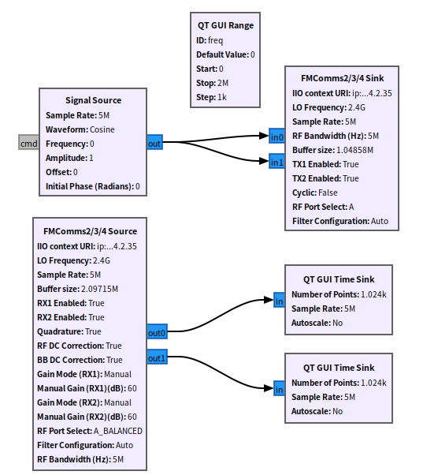
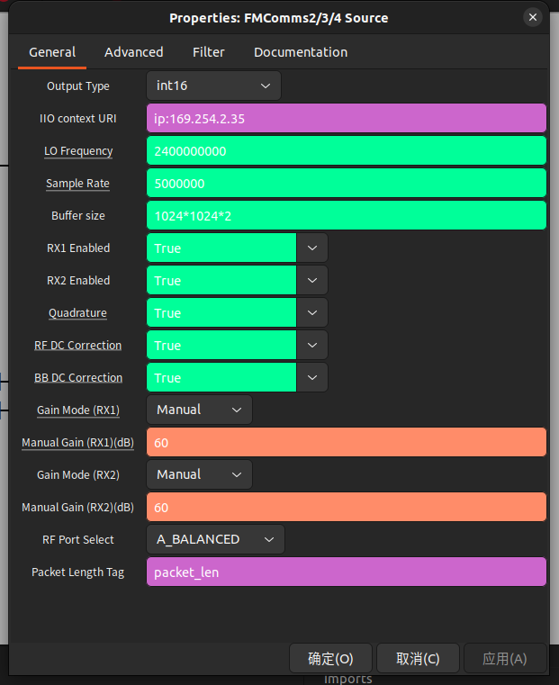

## E310 GNU Radio 

[[English]](../../../../device_and_usage_manual/ANTSDR_E_Series_Module/ANTSDR_E310_Reference_Manual/AntsdrE310_gnurdio.html)

### ●1. 概述

**[GNU Radio](https://www.gnuradio.org/)** 是一个免费且开源的软件开发工具包，提供了用于实现软件定义无线电（SDR）和信号处理系统的信号处理模块。它既可以与外部射频硬件配合使用，构建真实的软件定义无线电系统，也可以在无硬件的模拟环境中运行。GNU Radio 广泛应用于业余无线电、学术研究和商业领域，支持无线通信的研究和实际无线电系统的开发。

GNU Radio 提供了一个全面的框架，用于开发和运行软件无线电及信号处理应用。这些应用通常被称为“流程图”（flowgraphs），由多个相互连接的信号处理模块组成，描述了数据的流动过程。流程图可以使用 C++ 或 Python 编程语言编写。GNU Radio 的核心架构完全采用 C++ 实现，而许多用户工具则采用 Python 开发。

与所有软件定义无线电系统一样，可重构性是其关键特性。GNU Radio 开放的接口使用户能够轻松将自己的无线电设备集成到 GNU Radio 生态系统中，无需针对特定硬件进行设计。

### ●2.在ubuntu上安装libiio

不同Ubuntu版本有所不同，具体可以参考[安装资料](https://wiki.analog.com/resources/tools-software/linux-software/gnuradio)

#### ○1.安装系统包

在安装Pluto SDR驱动之前，先安装所需的依赖包，在终端输入以下命令

```
sudo apt install libxml2 libxml2-dev bison flex cmake git libaio-dev libboost-all-dev
sudo apt install libusb-1.0-0-dev
sudo apt install libavahi-common-dev libavahi-client-dev
sudo apt install bison flex cmake git libgmp-dev
sudo apt install swig
sudo apt install liborc-dev
```

#### ○2. 安装libiio

您可以在 [GitHub](https://github.com/analogdevicesinc/libiio) 上找到libiio的源码。

```
git clone -b v0.24 https://github.com/analogdevicesinc/libiio.git
cd libiio
mkdir build
cd build
cmake ../
make
sudo make install
cd ../..
```
#### ○3. 安装 libad9361-iio

```
git clone https://github.com/analogdevicesinc/libad9361-iio.git
cd libad9361-iio
mkdir build
cd build
cmake ../
make
sudo make install
cd ../..

```
### ●3. gnuradio 和 gr-iio

安装gnuradio

```
apt-get update
apt install gnuradio -y
ldconfig
```

安装完成后 ,查看安装的版本

```
gnuradio-companion -help
```

#### 安装 gr-iio

如果您安装的是gnuradio3.8则需要安装gr-iio。3.8+ 版 gr-iio 需要 `liborc-dev`

```
(sudo) apt install liborc-dev
```
从源代码构建并安装 gr-iio：

```
git clone -b upgrade-3.8 https://github.com/analogdevicesinc/gr-iio.git
cd gr-iio
mkdir build && cd build
cmake -DCMAKE_INSTALL_PREFIX:PATH=/usr ..
make 
sudo make install
cd ..
sudo ldconfig
```


对于 3.8 版本，请确保 gr-iio swig 接口已添加到您的 PYTHONPATH 中。否则，您将在 Python 中遇到导入错误。常用命令如下（取决于操作系统和安装位置）：

```
export PYTHONPATH=$PYTHONPATH:/usr/lib/python{PYTHON VERSION}/{site or dist}-packages
```
添加的路径是新安装的 iio 文件夹的位置。
对于 3.8.2 版本，无需执行其他步骤。


#### GNU Radio3.10

如果您使用的是 Gnuradio 3.10 或更高版本，则 Gnuradio 本身的基础安装中已包含 gr-iio，无需再安装。

所有安装完成后，我们可以在终端中打开 Gnuradio 。

```
gnuradio-companion
```

### ●4. 在 GNU Radio 中使用Pluto

进行前需要先使用 Pluto 固件，Pluto固件使用方法可在[此处](./AntsdrE310_Unpacking_examination_cn.md)

您可以在这里找到 antsdr gnuradio 示例：

您可以在[这里](https://github.com/MicroPhase/gnu-radio-demo)找到 ANTSDR GNU 示例。


#### ○通用

**IIO Context URI**: IP:192.168.1.10

**Buffer Size**: 内部缓冲区的大小（以样本为单位）。IIO 模块每次只能输入/输出一个包含样本的缓冲区

#### ○PlutoSDR source

○**RF Bandwidth(MHz)**: 配置 RX 模拟滤波器: RX TIA LPF 和 RX BB LPF.[Read more](https://wiki.analog.com/resources/tools-software/linux-drivers/iio-transceiver/ad9361#rx_rf_bandwidth_control)

○**Sample Rate(MSPS)**: 硬件每秒钟输入或输出采样数据的频率.[Read more](https://wiki.analog.com/resources/tools-software/linux-drivers/iio-transceiver/ad9361#settingquerying_the_rx_sample_rate)

○**LO Frequency(MHz)**: 选择 RX 本振频率。范围：70MHz 至 6GHz，调谐精度：1Hz.[Read more](https://wiki.analog.com/resources/tools-software/linux-drivers/iio-transceiver/ad9361#local_oscillator_control_lo)

○**Tracking**: [Read more](https://wiki.analog.com/resources/tools-software/linux-drivers/iio-transceiver/ad9361#calibration_tracking_controls)

○Quadrature

○RF DC

○BB DC

○**Manual Gain(dB)**: 仅在手动增益控制模式 (MGC) 下控制 RX 增益. [Read more](https://wiki.analog.com/resources/tools-software/linux-drivers/iio-transceiver/ad9361#mgc_setting_the_current_gain)

○**Gain Mode**: 选择一种可用模式: manual, slow_attack, hybrid 和 fast_attack. [Read more](https://wiki.analog.com/resources/tools-software/linux-drivers/iio-transceiver/ad9361#gain_control_modes)

○**Filter**: 允许从文件加载 FIR 滤波器配置. [Read more](https://wiki.analog.com/resources/tools-software/linux-drivers/iio-transceiver/ad9361#digital_fir_filter_controls)

○**Filter auto** 启用后会加载默认滤波器，从而实现较低的 sampling / baseband rates.


#### ○PlutoSDR Sink

○**RF Bandwidth(MHz)**: 配置 TX 模拟滤波器: TX BB LPF and TX Secondary LPF. [Read more](https://wiki.analog.com/resources/tools-software/linux-drivers/iio-transceiver/ad9361#tx_rf_bandwidth_control)

○**Sample Rate(MSPS)**: 硬件每秒钟输入或输出采样数据的频率. [Read more](https://wiki.analog.com/resources/tools-software/linux-drivers/iio-transceiver/ad9361#settingquerying_the_tx_sample_rate)

○**LO Frequency(MHz)**: 选择 TX 本振频率。范围：70MHz 至 6GHz，调谐精度：1Hz. [Read more](https://wiki.analog.com/resources/tools-software/linux-drivers/iio-transceiver/ad9361#local_oscillator_control_lo)


○**RF Port Select**: 选择射频端口.[Read more](https://wiki.analog.com/resources/tools-software/linux-drivers/iio-transceiver/ad9361#rf_port_selection)

○**Attenuation (dB)**: 分别控制 TX1 和 TX2 的衰减。范围为 0 至 -89.75 dB，步长为 0.25 dB.[Read more](https://wiki.analog.com/resources/tools-software/linux-drivers/iio-transceiver/ad9361#tx_attenuation_control)

○**Cyclic**: 如果需要“ Cyclic ”模式，请设置为“true”。在这种情况下，第一个缓冲区的样本将在 FMCOMMS-2 的已启用通道上重复，直到程序停止。

○**Filter**: 允许从文件加载 FIR 滤波器配置. [Read more](https://wiki.analog.com/resources/tools-software/linux-drivers/iio-transceiver/ad9361#digital_fir_filter_controls)

○**Filter auto** 启用后会加载默认过滤器，从而实现较低的 sampling / baseband rates.


### ●4. 在 GNU Radio 中使用 FMCOMMS

使用前，您需要使用 FMCOMMS 固件。您可以在此处找到 FMCOMMS 固件的使用方法 [fmcomms](./AntsdrE310_fmcomms_cn.md)

FMCOMMS-2 IIO 模块可以通过 IP 网络或 USB 运行。通过将“IIO context URI”参数设置为目标板的 IP 地址，您可以从远程传输样本。



**IIO Context URI**: IP:192.168.1.10

**Buffer Size**: 内部缓冲区的大小（以样本为单位）。IIO 模块每次只能输入/输出一个包含样本的缓冲区

#### ○ FMCOMMS SOURCE
○**RF Bandwidth(MHz)**: 配置TX模拟滤波器: TX BB LPF and TX Secondary LPF. [Read more](https://wiki.analog.com/resources/tools-software/linux-drivers/iio-transceiver/ad9361#rx_rf_bandwidth_control)

○**Sample Rate(MSPS)**: 硬件每秒钟输入或输出采样数据的频率 . [Read more](https://wiki.analog.com/resources/tools-software/linux-drivers/iio-transceiver/ad9361#settingquerying_the_rx_sample_rate)

○**LO Frequency(MHz)**: 选择TX本振频率。范围：70MHz至6GHz，调谐粒度：1Hz. [Read more](https://wiki.analog.com/resources/tools-software/linux-drivers/iio-transceiver/ad9361#local_oscillator_control_lo)

○**RF Port Select**: 选择要使用的 RF 端口. [Read more](https://wiki.analog.com/resources/tools-software/linux-drivers/iio-transceiver/ad9361#rf_port_selection)

○**Tracking**: [Read more](https://wiki.analog.com/resources/tools-software/linux-drivers/iio-transceiver/ad9361#calibration_tracking_controls)

○Quadrature

○RF DC

○BB DC

○**Manual Gain(dB)**:仅在手动增益控制模式 (MGC) 下控制 RX 增益.. [Read more](https://wiki.analog.com/resources/tools-software/linux-drivers/iio-transceiver/ad9361#mgc_setting_the_current_gain)

○**Gain Mode(RX1, RX2)**: 选择一种增益模式: manual, slow_attack, hybrid and fast_attack. [Read more](https://wiki.analog.com/resources/tools-software/linux-drivers/iio-transceiver/ad9361#gain_control_modes)




#### ○FMCOMMS SINK

○**RF Bandwidth(MHz)**: 配置TX模拟滤波器: TX BB LPF and TX Secondary LPF. [Read more](https://wiki.analog.com/resources/tools-software/linux-drivers/iio-transceiver/ad9361#rx_rf_bandwidth_control)

○**Sample Rate(MSPS)**:  硬件每秒钟输入或输出采样数据的频率. [Read more](https://wiki.analog.com/resources/tools-software/linux-drivers/iio-transceiver/ad9361#settingquerying_the_rx_sample_rate)

○**LO Frequency(MHz)**: 选择TX本振频率。范围：70MHz 至 6 GHz，调谐精度：1Hz. [Read more](https://wiki.analog.com/resources/tools-software/linux-drivers/iio-transceiver/ad9361#local_oscillator_control_lo)

○**RF Port Select**: 选择要使用的RF端口. [Read more](https://wiki.analog.com/resources/tools-software/linux-drivers/iio-transceiver/ad9361#rf_port_selection)

**Attenuation(RX1, RX2)(dB)**: 别控制 TX1 和 TX2 的衰减。范围为 0 至 -89.75 dB，步长为 0.25dB。[Read more](https://wiki.analog.com/resources/tools-software/linux-drivers/iio-transceiver/ad9361#tx_attenuation_control)


○**Cyclic**: 如果需要“ Cyclic ”模式，请设置为“true”。在这种情况下，第一个缓冲区的样本将在 FMCOMMS-2 的已启用通道上重复，直到程序停止。

○**TX1/TX2** 使能: 启用传输数据路径

○**Filter**: 允许从文件加载 FIR 滤波器配置. [Read more](https://wiki.analog.com/resources/tools-software/linux-drivers/iio-transceiver/ad9361#digital_fir_filter_controls)

○**Filter auto** 启用后会加载默认过滤器，从而启用较低的ampling / baseband rates.


