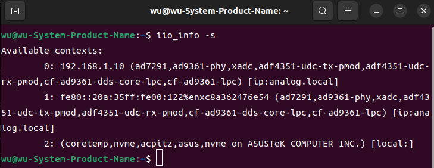
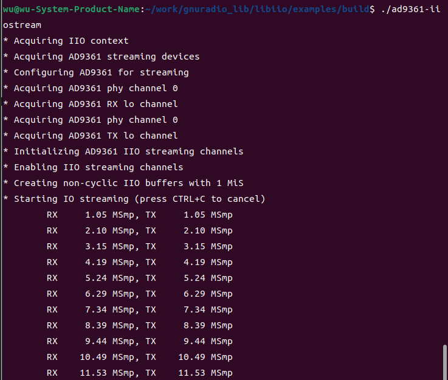

## E310 libiio 使用

[[English]](../../../../device_and_usage_manual/ANTSDR_E_Series_Module/ANTSDR_E310_Reference_Manual/AntsdrE310_libiio.html)

### ●1. 概述

**libiio** 是由 Analog Devices 开发的一个库，用于简化与 Linux 工业 I/O（IIO）设备接口的软件开发。该库抽象了硬件的低级细节，并提供了一个简单而完整的编程接口，可用于高级项目。
这里，我们通过编译 **libiio** 提供的一个例子，分别将其运行在主机上和嵌入式平台上。该例子是通过 c/c++接口来配置射频端，并填充获取发送接收 IQ 数据流。该文档适合有编程基础的人观看，涉及的内容有 c/c++，交叉编译等。本章所介绍内容均运行在 Linux 平台下（Ubuntu）。

### ●2. 安装 libiio

如果您没有安装 **libiio**，请先进行安装。 

有关 **libiio** 的安装，请参阅[官方指南](https://wiki.analog.com/resources/eval/user-guides/ad-fmcdaq2-ebz/software/linux/applications/libiio#:~:text=Libiio%20is%20a%20library%20that%20has%20been%20developed,of%20software%20interfacing%20Linux%20Industrial%20I%2FO%20%28IIO%29%20devices.)或者参阅 [《E310 GNU Radio》](./AntsdrE310_gnurdio_cn.md)

或者

您可以在以下位置找到安装 **libiio** 的详细步骤 [ANTSDR E310 GNU Radio](./AntsdrE310_gnurdio_cn.md)


如果您已经成功安装 **libiio**，请执行 iio_info -s



### ●3. 源代码

Microphase 已为用户提供源代码。这里我们需要编译并运行 `ad9361-iiostream.c` 文件。首先，创建一个新文件夹 `(libiio_example)` ，并在该文件夹下创建名为 `arm` 和 `host` 的文件夹。将 `ad9361-iiostream.c` 文件复制到上述文件夹中。

[源码地址](https://github.com/MicroPhase/antsdr_doc_en/tree/master/demo/iio)

您需要下载该代码

下载完成后，进入下载的目录。

如果直接在电脑上运行该程序，则需要运行以下命令

```
mkdir build && cd build
cmake ..
make
./ad9361-iiostream
```

执行 `./ad9361-iiostream` ，你会看到如下所示的结果


如果直接在arm上运行程序，需要交叉编译知识。我们需要arm编译工具。此处用的是 **Xilinx SDK** 自带的32位编译工具。编译工具的版本和固件的版本需要保持一致。

```
set (CMAKE_C_COMPILER "/tools/Xilinx/SDK/2019.1/gnu/aarch32/lin/gcc-arm-linux-gnueabi/bin/arm-linux-gnueabihf-gcc")
set (CMAKE_CXX_COMPILER "/tools/Xilinx/SDK/2019.1/gnu/aarch32/lin/gcc-arm-linux-gnueabi/bin/arm-linux-gnueabihf-g++")

```
您可以在以下位置找到编译工具链和版本之间的关系 [ANTSDR-FW-Patch](./Antsdr-fw-patch_cn.md)

使用scp命令将其发送到ANTSDR并运行

```
scp ad9361-iiostream root@192.168.1.10:~
```

通过ssh或者串口登录开发板

```
./ad9361-iiostream
```

读者可以在这里找到 libiio 接口：
[https://analogdevicesinc.github.io/libiio/master/libiio/index.html](https://analogdevicesinc.github.io/libiio/master/libiio/index.html)