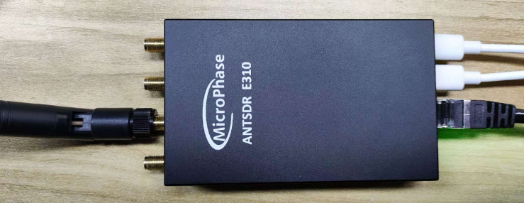
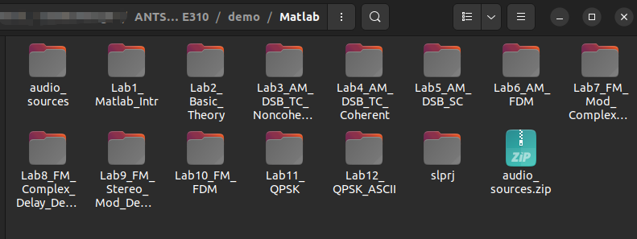
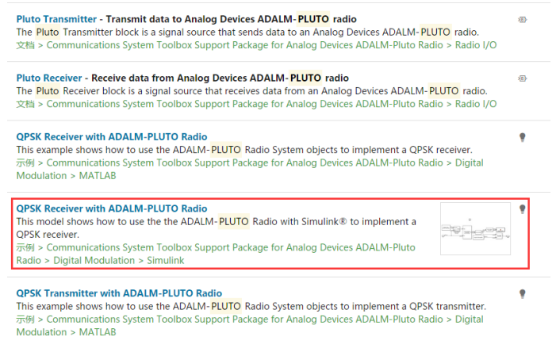
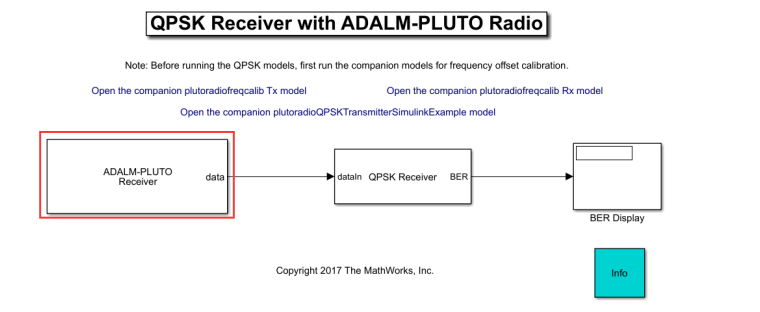
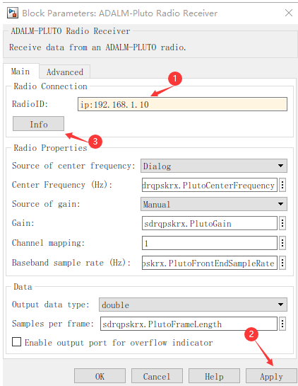
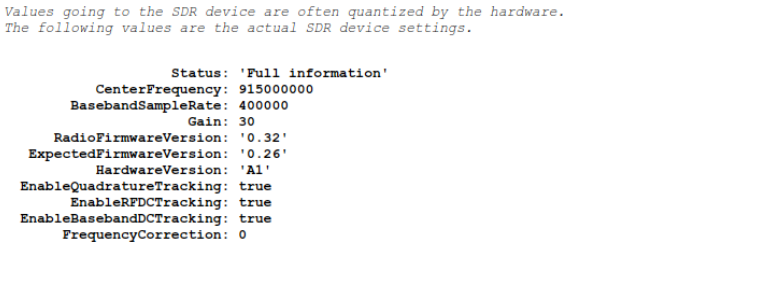

## E310 MATLAB 

[[English]](../../../../device_and_usage_manual/ANTSDR_E_Series_Module/ANTSDR_E310_Reference_Manual/AntsdrE310_matlab.html)

### ●1. 概述

使用 ANTSDR，用户能够很方便地接入到各种 SDR 软件当中，可以尝试各种有趣的无线电实验。比如在 **GNU Radio** 和 **Matlab&Simulink** 中，用户可以在软件上实现通信和信号处理相关的算法，然后通过 ANTSDR 来实现信号的发射和接收。又或者可以使用开源的软件，来进行诸如广播解调，电视信号解调，飞机追踪等有意思的功能。

本章将安装PlutoSDR硬件支持包。所有Matlab相关的实验都是在Windows 10平台下进行的，因此需要在Windows 10下安装驱动程序，这样我们才能正确使用ANTSDR硬件设备。关于 **Matlab & Simulink** 的下载安装，用户可以在 **Matlab** 官网注册并下载安装。

如果要在 **Ubuntu** 下使用 MATLAB，步骤与 **Windows** 相同。

如果您第一次使用 ANTSDR ，请先查阅 [《E310 开箱检测》](./AntsdrE310_Unpacking_examination_cn.md)

### ●2. 安装驱动

如果你没有安装PlutoSDR驱动，可以点击[下载Windows驱动](https://wiki.analog.com/university/tools/pluto/drivers/windows)。

资料里也提供了对应的驱动程序，双击 `.exe` 文件进行安装，一直点击“下一步”即可成功安装驱动程序。

ANTSDR 使用的处理器是 ZYNQ，该处理器包含了两个 A9 的核，能够在上面运行操作系统，ANTSDR 移植了 PlutoSDR 的固件，因此也能够通过命令行的方式来访问到 ANTSDR 上的硬件设备。

Pluto固件可以从[相应的GitHub链接](https://github.com/MicroPhase/antsdr-fw-patch/releases)进行下载.

### ●3. 安装硬件支持包

在本手册中这部分使用的是Matlab 2018.a版本，用户可以自行选择2018.a及以上版本进行安装。所提供资料中的Simulink仿真模型均基于2018.a版本。

安装Matlab后，需要安装PlutoSDR的硬件支持包才能使用ANTSDR。在上方菜单栏中选择附加功能，选择获取硬件支持包

搜索 `pluto` ，点击PlutoSDR 通讯工具组件安装硬件支持包。在安装硬件支持包的时候，需要有一个 Mathworks 的账号，您可以在线注册一个 Mathworks 的账号，然后进行登录即可。

ADALM-PLUTO的安装步骤可以在Matlab官网找到或者您可以点击链接查阅此文档中：[安装 Analog Devices ADALM-PLUTO 无线电支持包](https://ww2.mathworks.cn/help/comm/plutoradio/ug/install-support-package-for-pluto-radio.html)

安装完成后需要关闭所有打开的Matlab，然后重新启动Matlab再进行后续步骤。



ANTSDR 系统启动时，以太网 IP 地址为 `192.168.1.10`。为了使主机能够正常访问 ANTSDR，需要将电脑的 IP 地址设置为与 ANTSDR 同一网段。您可以参考 [《E310 开箱检测》](./AntsdrE310_Unpacking_examination_cn.md)的网络设置。


### ●4.测试连接

设置好上位机IP地址后，就可以使用Matlab中的PlutoSDR示例程序测试当前ANTSDR的连接状态。

在提供的资料中，您可以找到与此相关的所有 matlab 演示：


在右上角的搜索框中输入pluto进行搜索，然后在弹出的窗口中打开一个simulink仿真模型。




选择 Open Model 打开模拟模型。



双击 **ADALM-PLUTO 接收器模块**，打开设置窗口。在设置窗口中，将 Radio ID 设置为

```
ip:192.168.1.10
```

然后点击 **Apply**，再点击 **Info** 就可以看到当前设备的信息了。





### 使用 FMCOMMS 镜像连接到 MATLAB

如果您还不熟悉在E310上使用FMCOMM镜像，您可以先看[《E310 FMCOMMS》](./AntsdrE310_fmcomms_cn.md) 章节。
本手册这里使用的是Matlab 2021.a版本，推荐您使用相同版本以确保最佳兼容性。

打开 Matlab，在下面网站下载对应Matlab 版本的工具包：[下载工具包](https://github.com/analogdevicesinc/TransceiverToolbox/releases)。然后在Matlab双击点击安装就可以了

设置电脑 IP 为 `192.168.1.100`,此时电脑可以 ping 通设备。
在 Matlab 中新建脚本，输入下面的代码测试连接
```
clear all;

%% Tx set up
tx = adi.AD9361.Tx; 
tx.uri = 'ip:192.168.1.10';  
tx.DataSource = 'DDS';   
tx.DDSFrequencies = [0 0; 1e5 1e5]; 
tx.DDSPhases = [0 0; 180e3 0]; 
tx.DDSScales = [0 0; 1 1]; 
tx.CenterFrequency = 2.4e9; 
tx.RFPortSelect = 'B';
tx();
pause(1);       

%% Rx set up
rx = adi.AD9361.Rx('uri','ip:192.168.1.10');
rx.CenterFrequency = tx.CenterFrequency;
rx.EnabledChannels = [1,2];
rx.GainControlModeChannel0 = 'manual';
rx.GainControlModeChannel1 = 'manual';
rx.GainChannel0 = 50;
rx.GainChannel1 = 50;
rx.SamplingRate = 3e6;
y = rx();   

tx.release();
rx.release(); %释放资源

%将衰减器连接在TX1上，连接一个1分2接到rx上
out=y';
figure(1); 
plot(real(out(1,1:1000)));
hold on;
plot(imag(out(1,1:1000)));
figure(2) 
plot(real(out(2,1:1000)));
hold on;
plot(imag(out(2,1:1002)))
```