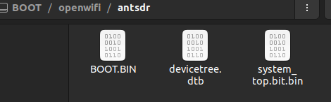
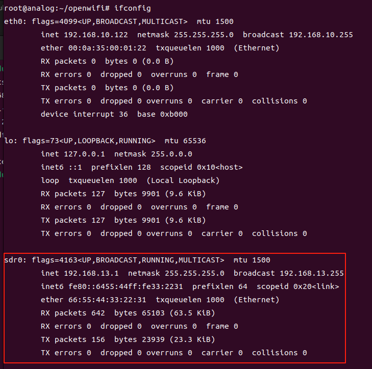
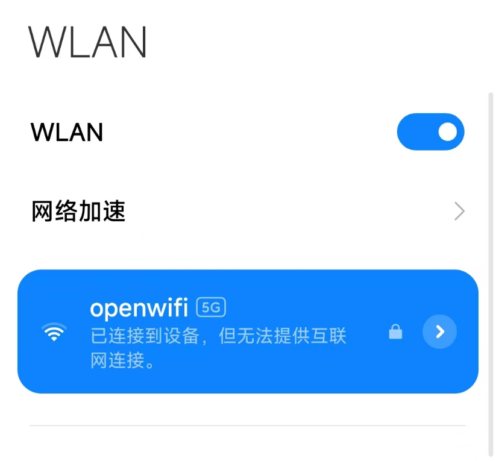

## E310 OpenWiFi 

[[English]](../../../../device_and_usage_manual/ANTSDR_E_Series_Module/ANTSDR_E310_Reference_Manual/AntsdrE310_openwifi.html)
### 1. 概述

OpenWiFi 是一个基于 ZYNQ7000+AD936x 的一个开源项目，该项目在 FPGA 上实现了一个用于处理 WiFi 信号的 IP 核，以满足 WiFi 传输时所需要的延时要求。该项目同时还实现了 linux 上对 OpenWiFi IP 的驱动的实现，基于这个开源项目，用户可以了解 WiFi 的底层的工作原理，感兴趣的用户可以在该项目的 github 主页上了解更多信息。Github 的仓库地址如下：
[https://github.com/open-sdr/openwifi](https://github.com/open-sdr/openwifi)

我们将介绍如何使用 ANTSDR E310 运行 OpenWiFi，使 ANTSDR E310 能够成为一个 WiFi 路由器

### 2. 在 Ubuntu 中刻录镜像

在开始之前，您需要[下载 OpenWiFi的镜像文件](https://drive.google.com/file/d/12egFLT9TclmY8m3vCMHmUuSne3qK0SWc/view?pli=1)。

解压并刻录到 SD 卡（>=16GB）。之后，SD 卡应该有两个分区：`BOOT` 和 `rootfs` 。要烧写 SD 卡，你可以使用 `dd` 命令将镜像烧录到SD卡

```
sudo dd bs=512 count=31116288 if=openwifi-xyz.img of=/dev/your_sdcard_dev
(为了获得正确的计数值，最好通过“fdisk -l img_filename”检查.img文件的实际情况")
```
SD 卡刻录完成后，
将 SD 卡插入电脑，并将启动文件复制到 SD 卡的 `BOOT` 分区。启动文件的位置在`BOOT`分区下`openwifi`目录中，这个目录中存放了不同设备的启动文件，ANTSDR E310设备启动文件在 ANTSDR 目录中



### 3.启动系统

SD 卡烧录完成之后，将 SD 卡插入到 ANTSDR 当中。此时连接上电源，系统就会启动，想要观察系统启动的打印信息，可以使用终端工具连接到串口

```
sudo screen /dev/ttyUSB1 115200
```
系统启动后，您可以在串口终端输入以下命令，使ANTSDR E310成为WiFi路由器。

```
./openwifi/setup_once.sh (执行后重启设备。只需运行一次)
cd openwifi
./wgd.sh
./fosdem.sh
```
等到该命令运行结束之后，可以看到打印信息会出现一个 `sdr0:AP-ENABLED` ,这说明 ANTSDR 作为 WiFi 的 AP 功能已经就绪，这时候使用 `ifconfig` 命令可以看到当前的网络设备当中多出了以一个 `sdr0` 。



这时拿出手机，打开 WiFi 应该能够搜索到一个名为 openwif 的设备。



当前该 WiFi 还不可以上网，但是连接到该 WiFi 之后，可以打开 OpenWiFi 的内置网页，用户可以在连接到 OpenWiFi 的状态下，在浏览器中输入 192.168.13.1 可以打开内置 OpenWiFi 的内置网页。

若用户想要通过 ANTSDR 上运行着的 OpenWiFi 连接到网络，需要用户有一台 Linux 的电脑，使用网线，将ANTSDR E310 连接到 Linux 电脑的网口上，然后在 Linux 系统的终端中输入如下命令：

```
sudo sysctl -w net.ipv4.ip_forward=1
sudo iptables -t nat -A POSTROUTING -o NICY -j MASQUERADE
sudo ip route add 192.168.13.0/24 via 192.168.10.122 dev ethX 
```
其中 `NICY` 是用户的电脑另外一个可以联网的网络设备，比如 `wlan0`, `ethX` 是用户连接到 ANTSDR 的以太网设备端口。

示例：

```
sudo sysctl -w net.ipv4.ip_forward=1
sudo iptables -t nat -A POSTROUTING -o wlan0 -j MASQUERADE
sudo ip route add 192.168.13.0/24 via 192.168.10.122 dev eth0
```
此时您使用手机连接OpenWiFi，就通过OpenWiFi上网了。这样，ANTSDR E310就变成了一个简单的WiFi路由器。