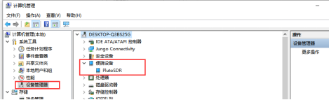

## E316 开箱检测

[[English]](../../../../device_and_usage_manual/ANTSDR_E_Series_Module/ANTSDR_E316_Reference_Manual/AntsdrE316_Unpacking_examination.html)

### 1. 概述

E316 是一款面向专业应用场景的软件无线电,支持70 MHz - 6 GHz 的宽频段射频信号收发，既可以作为 USB 外设使用，也可以通过编程实现脱机运行。经过两代产品的迭代，E316具有更强的发射功率，更优的接收灵敏度，更低的底噪和相噪，更完善的无线应用接口。ANTSDR在无线电应用领域已经积累了丰富的成功应用案例，涵盖频谱监测,无人机，GPS，无线电分析等多个方向。

### 2. 物品清单

感谢您购买微相科技有限公司的 ANTSDR 系列软件无线电平台，当您拿到ANTSDR E316（标准版）之后，打开配件包，其中应包含如下内容，

- ANTSDR 软件无线电: X1
- USB 数据线: X2 
- 胶棒天线: X2
- 托盘天线: X1
- 网线: X1
- 32GB SD 卡 X1

### 3. 使用 **Pluto 固件**收听广播

用于启动模式切换的 DIP 开关位于以太网口下方，可见 “BOOT / QSPI / SD” 标识。
ANTSDR E316 出厂时，SD 卡和 QSPI 中均已烧录 Pluto 固件，因此无论从 QSPI 还是 SD 启动，系统均加载 Pluto 固件，无需额外操作即可使用。

设备启动成功后，绿色指示灯会闪烁。

若设备中未安装 Pluto 固件，可从 [GitHub 下载](https://github.com/MicroPhase/antsdr-fw-patch/releases)并烧录。

Pluto 固件默认配置如下：

- **IP 地址**：192.168.1.10
- **用户名 / 密码**：root / analog
- **串口波特率**：115200

#### ● Windows 系统

[下载PlutoSdr驱动](https://wiki.analog.com/university/tools/pluto/drivers/windows)

[下载串口驱动](https://ftdichip.com/wp-content/uploads/2021/08/CDM212364_Setup.zip)

○1. 安装 Windows 驱动程序： **CDM212364_Setup.exe** 和 **PlutoSDR-M2K-USB-Drivers.exe**

将网线一端连接到ANTSDR，另一端连接到电脑。连接天线到RX1端口

○2. 之后，您可以在 **计算机管理 → 设备管理器** 中看到 **PlutoSDR** 设备。

如果未显示设备，请检查以下项是否正确：

- 固件是否烧录成功
- 驱动程序是否已正确安装
- USB OTG 是否正确插入

○3.在您电脑的网络适配器中，依次设置本机IP地址、子网掩码、网关。本机IP地址设置为与ANTSDR同一网段，例如 `192.168.1.100` 。子网掩码设置为 `255.255.255.0` ，默认网关设置为 `192.168.1.1` 。

○4. ANTSDR 设备 IP 为 `192.168.1.10`，此时需要打开**CMD**窗口，`ping 192.168.1.10`

○5. 收听广播

在 Windows 中运行 **SDRSharp.exe** 文件来收听广播

ANTSDR设备IP为`192.168.1.10`

连接成功后，选择广播频道，开始收听广播。

### ● Linux 系统

○1. Pluto 固件默认 IP 为 `192.168.1.10`，将本地 IP 地址设置为 `192.168.1.100`，然后 `ping 192.168.1.100` 。

○2. 关于 **libiio** 的安装，请参阅 [官方指南](https://wiki.analog.com/resources/eval/user-guides/ad-fmcdaq2-ebz/software/linux/applications/libiio)，或参考[《E310 GNU Radio》](./AntsdrE316_gnurdio_cn.md)。

○3. 如果已经安装了 **libiio** ，执行`iio_info -s`

可以通过千兆以太网或 USB OTG 连接。
打开 sdr++ 软件。
连接成功后，即可开始收听广播。

