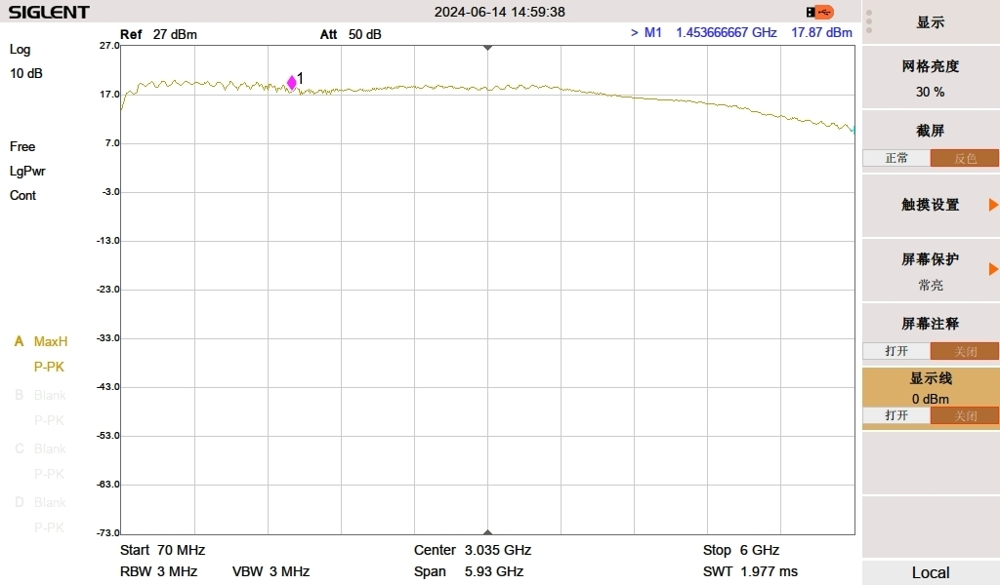

## U200 RF

[[English]](../../../../device_and_usage_manual/ANTSDR_U_Series_Module/ANTSDR_U200_Reference_Manual/AntsdrU200_RF_parameters.html)

### U200 TX 功率

AD9361是一款面向3G和4G基站应用的高性能、高集成度的射频 (RF) Agile Transceiver™捷变收发器。该器件的可编程性和宽带能力使其成为多种收发器应用的理想选择。该器件集RF前端与灵活的混合信号基带部分为一体，集成频率合成器，为处理器提供可配置数字接口，从而简化设计导入。AD9361接收器LO工作频率范围为70 MHz至6.0 GHz，发射器LO工作频率范围为47 MHz至6.0 GHz，涵盖大部分特许执照和免执照频段，支持的通道带宽范围为200 kHz以下至56 MHz。

### AD9361 数据手册

您可以在此处找到 AD9361 数据手册：[Data Sheet](https://www.analog.com/en/products/ad9361.html)

### ANTSDR 选型

| Signal Name   |     U220        |  U200     |E200              | E310      | E316        |
| ------------- | ----------      |------     | --------------   | ----------| ----------  |   
| RFIC          | AD9361/3        |  AD9363           |   AD9361/3       |AD9361/3  |  AD9361/3    |
| RF channel    |  2T2R MIMO      |SMA:1T1R IPEX:1T1R  |SMA:1T1R IPEX:1T1R|2T2R MIMO  |2T2R MIMO      |
| FPGA/SoC      | ARTIX7 200T     | ARTIX7 100T |ZYNQ XC7Z020  | ZYNQ XC7Z020   |ZYNQ XC7Z020   |
| DDR3          |  PL 512MB       | PL 512MB        |PS 512MB     | PS 1GB         | PS 1GB        |
| Host Interface                  |    USB3.0 | USB3.0        |      1G ETH      | 1G ETH         |1G ETH           |
| Transmission bandwidth to host  |  56MSPS    |56MSPS       |     20MSPS      | 10MSPS         | 20MSPS          | 
|Clock synchronization            |   10M/PPS /GPS  | 10M/PPS  |10M/PPS          | 10M/PPS        | 10M/PPS          |
| API        |  UHD & C/C++ /PYTHON  | UHD & C/C++ /PYTHON  | Libiio & UHD /C/C++ /PYTHON  | Libiio &  C/C++ /PYTHON  |   Libiio & UHD & C/C++ /PYTHON |  