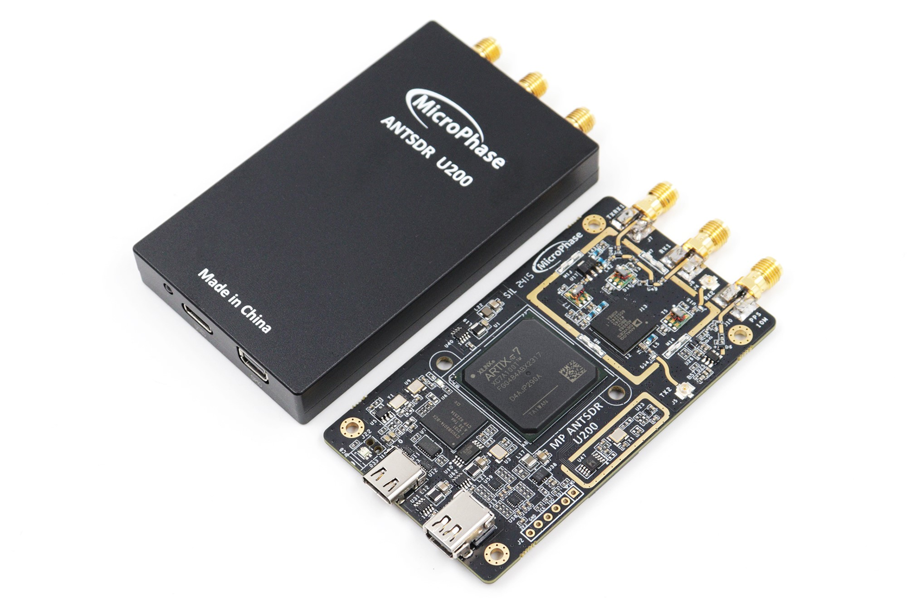

## U200 硬件手册

[[English]](../../../../device_and_usage_manual/ANTSDR_U_Series_Module/ANTSDR_U200_Reference_Manual/AntsdrU200_Reference_Manual.html)

### 概述

与ANTSDR E系列不同,U系列采用了USB3.0接口,5Gbps瞬时速率，可以轻松跑满AD9361的最大带宽。基带芯片采用Xilinx Artix-7 XC7A100T, 对于对成本敏感且对性能有非常高需求的用户，U200可以轻松应对。

  ### 资源特性

- Xilinx Artix-7 XC7A100T
- Analog Devices AD9363 
- 1个TYPE-C USB3.0接口
- 1个22-Pin 0.5mm间距FPC GPIO拓展口
- 1个6-Pin 2.54mm间距JTAG拓展口
- 1个外部 PPS/10MHz 参考输入接口
- 1 个发射通道和 1 个接收通道，支持半双工或全双工
- 灵活采样率的 12 位 ADC 和 DAC
- 集成射频前端（325 MHz - 3.8 GHz）
- 可变模拟带宽（200 kHz - 20 MHz）
