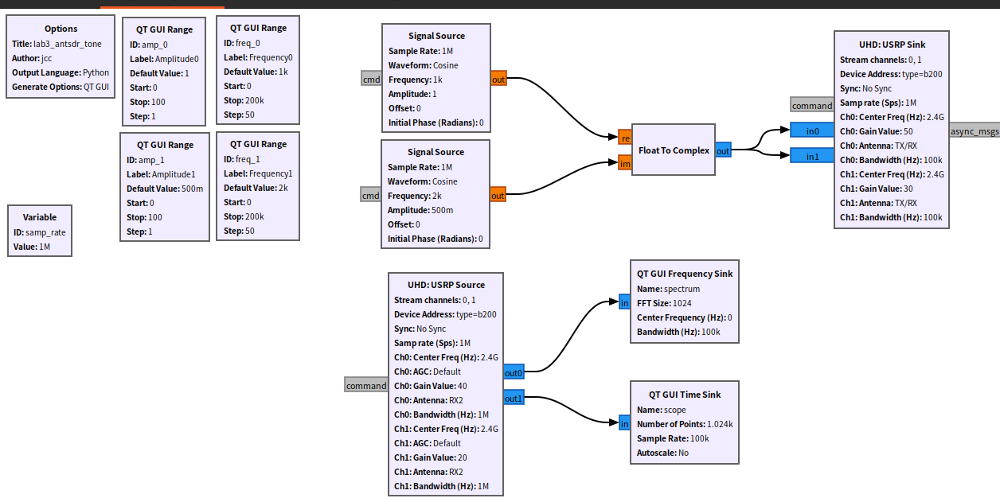
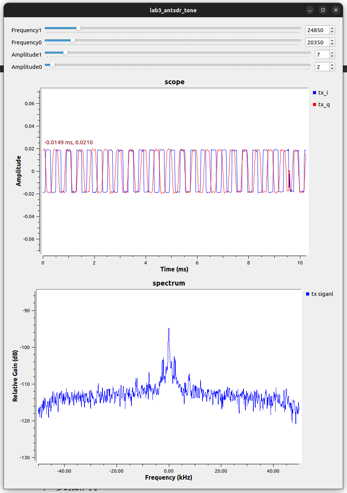

## U200 Gnu Radio

[[English]](../../../../device_and_usage_manual/ANTSDR_U_Series_Module/ANTSDR_U200_Reference_Manual/AntsdrU200_gnuradio.html)

### ●1. 概述

**[GNU Radio](https://www.gnuradio.org/)** 是一个免费且开源的软件开发工具包，提供了用于实现软件定义无线电（SDR）和信号处理系统的信号处理模块。它既可以与外部射频硬件配合使用，构建真实的软件定义无线电系统，也可以在无硬件的模拟环境中运行。GNU Radio 广泛应用于业余无线电、学术研究和商业领域，支持无线通信的研究和实际无线电系统的开发。

GNU Radio 提供了一个全面的框架，用于开发和运行软件无线电及信号处理应用。这些应用通常被称为“流程图”（flowgraphs），由多个相互连接的信号处理模块组成，描述了数据的流动过程。流程图可以使用 C++ 或 Python 编程语言编写。GNU Radio 的核心架构完全采用 C++ 实现，而许多用户工具则采用 Python 开发。

与所有软件定义无线电系统一样，可重构性是其关键特性。GNU Radio 开放的接口使用户能够轻松将自己的无线电设备集成到 GNU Radio 生态系统中，无需针对特定硬件进行设计。

#### ○1.安装系统包

在安装Pluto SDR驱动之前，先安装所需的依赖包，在终端输入以下命令

```
sudo apt install libxml2 libxml2-dev bison flex cmake git libaio-dev libboost-all-dev
sudo apt install libusb-1.0-0-dev
sudo apt install libavahi-common-dev libavahi-client-dev
sudo apt install bison flex cmake git libgmp-dev
sudo apt install swig
sudo apt install liborc-dev
```
从源安装 Gnu Radio
```
git clone https://github.com/gnuradio/gnuradio.git
cd gnuradio
git checkout maint-3.8
git submodule update --init --recursive
mkdir build
cd build
cmake -DCMAKE_BUILD_TYPE=Release -DPYTHON_EXECUTABLE=/usr/bin/python3 ../
make
sudo make install
sudo ldconfi
```
接下来添加环境变量：
```
gedit ~/.bashrc
```
在最后一行加入
```
export PYTHONPATH=/usr/local/lib/python3/dist-packages:/usr/local/lib/python3.8/dist-packages:$PYTHONPATH
export LD_LIBRARY_PATH=/usr/local/lib:$LD_LIBRARY_PATH
```
安装完成后就可以打开了
```
gnuradio-companion
```

打开资料中的流图进行测试


如果执行不成功 ，请确认您是否 正确安装GNU Radio和 是否有 USB 3.0 的权限

测试结果如图所示



