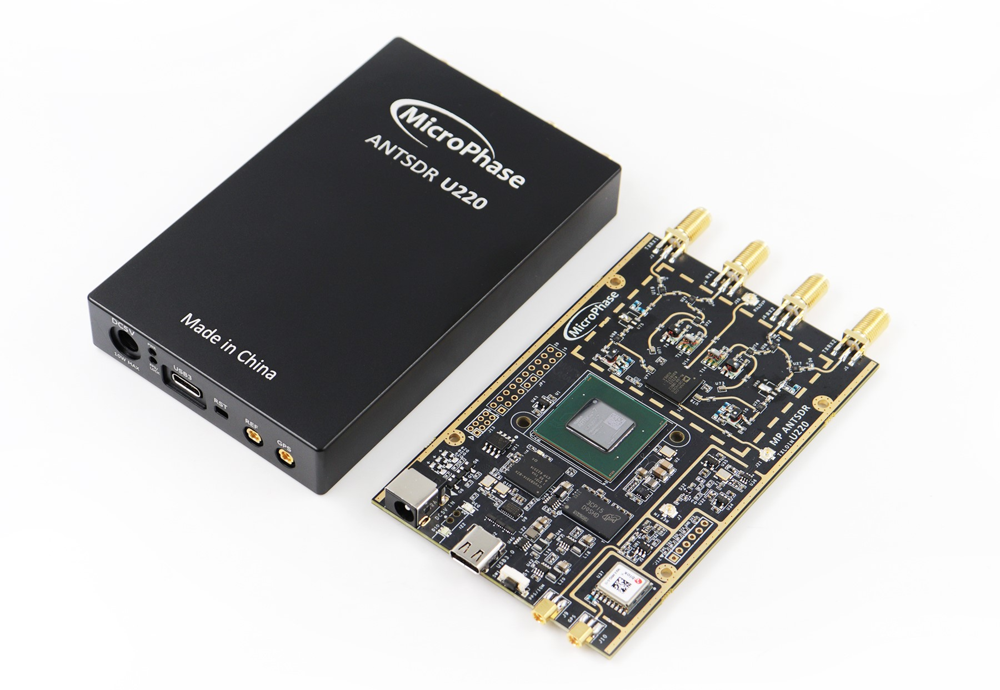

## U220 硬件手册

[[English]](../../../../device_and_usage_manual/ANTSDR_U_Series_Module/ANTSDR_U220_Reference_Manual/AntsdrU220_Reference_Manual.html)

### 概述

与ANTSDR E系列不同,U系列采用了USB3.0接口,5Gbps瞬时速率，可以轻松跑满AD9361的最大带宽。基带芯片采用Xilinx Artix-7 XC7A200T,更大逻辑，更快处理速度,增加数据缓存功能,极大减少大带宽数据传输下的丢包现象,数据传输更稳定。

  ### 资源特性

- Xilinx Artix-7 XC7A200T
- Analog Devices AD9361/9363 
- 1个TYPE-C USB3.0接口
- 1个20-Pin 2.54mm间距GPIO拓展口
- 1个6-Pin 2.54mm间距JTAG拓展口
- 1个外部 PPS/10MHz 参考输入接口
- 1个GPS同步输入接口
- 2 个发射通道和 2 个接收通道，支持半双工或全双工
- 灵活采样率的 12 位 ADC 和 DAC
- 集成射频前端（AD9361：70 MHz - 6 GHz，AD9363：325 MHz - 3.8 GHz）
- 可变模拟带宽（AD9361：200 kHz - 56 MHz，AD9363：200 kHz - 20 MHz）

